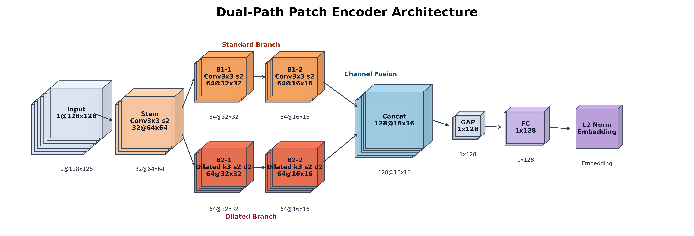
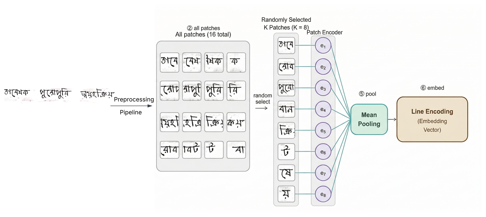
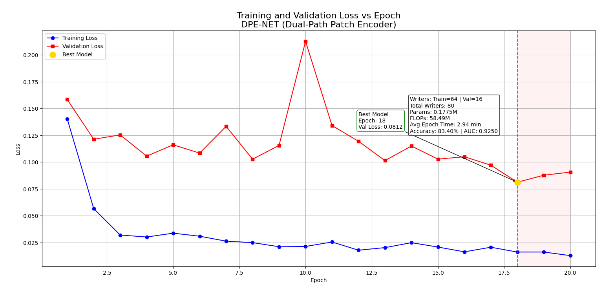
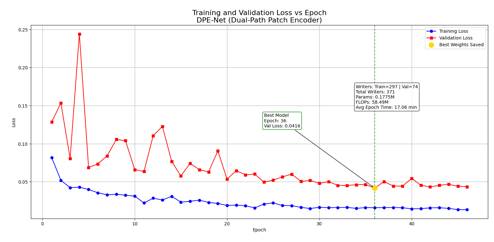
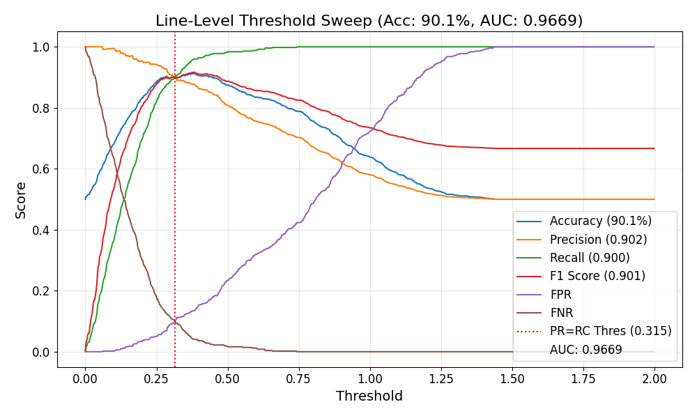
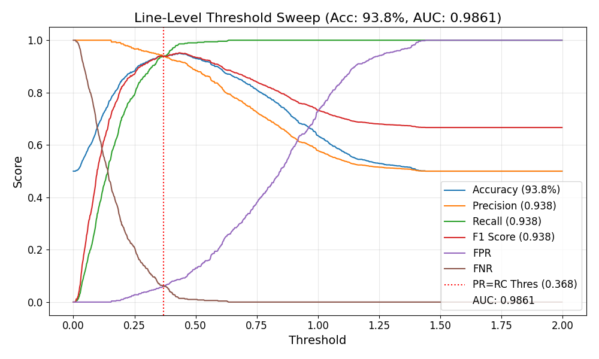
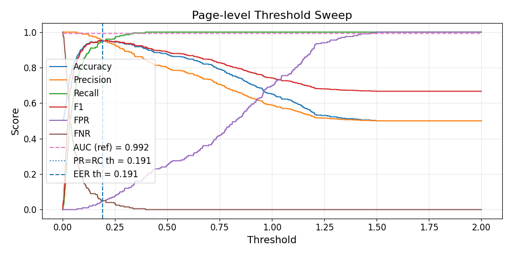
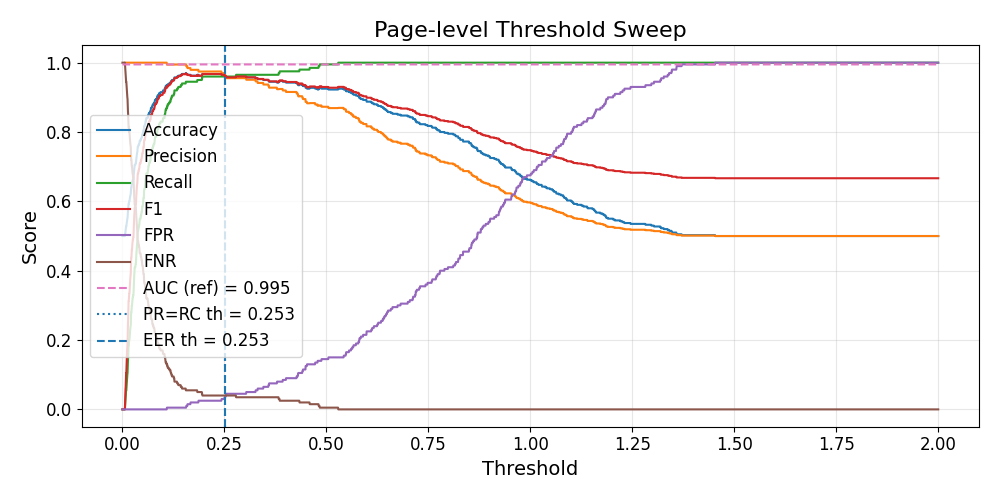

# A Unified Framework for Open-Set Bengali Handwriting Analysis: Writer Verification, Retrieval, Clustering, and Sequential Multi-Writer Segmentation

# 0 Abstract:

Automated handwriting analysis has diverse applications in forensic and archival processing. However, most frameworks are restricted to closed-set conditions and isolated character or word-level identification. These limitations are pronounced for complex scripts like Bengali (Bangla), where offline, full-document biometric analysis is exceptionally rare. 

In this work, we present an "all-in-one" Deep Embedding Framework executing four offline tasks—writer verification, writer retrieval, unsupervised document clustering, and sequential multi-writer segmentation—at the full-page level under strict zero-shot, open-set protocols. To isolate biometric style from layout noise, we introduce a Patch-to-Line-to-Page hierarchical integration pipeline that preserves the spatial sequence of human penmanship. Addressing computational bottlenecks, we engineered a highly optimized custom CNN, the Dual-Path Patch Encoder (DPE-Net), and adapted the pretrained FasterNet-T0. Evaluated on a curated dataset of 435 writers, these models provide scalable solutions for edge and cloud environments.

This framework establishes the first open-set document or page level baselines across all four operations for Bangla. For page-level verification, FasterNet-T0 and DPE-Net achieved 96.00% and 95.00% accuracy, respectively. In retrieval, they secured 100.00% and 94.20% Top-1 accuracies. For unsupervised clustering, our approach yielded pairwise accuracies of 98.64% and 96.03%. Finally, we pioneer the novel task of sequential multi-writer segmentation—detecting and mapping distinct authors collaborating on a single page. Here, FasterNet-T0 achieved 79.38% absolute sequence accuracy, while DPE-Net provided a highly stable Sequence Error Rate of 0.0868. Ultimately, this unified framework significantly expands forensic document examination capabilities.

# 1. Introduction

**Writer verification** (1:1 matching) determines whether two different handwriting samples were authored by the same person. **Writer retrieval** (1:N search) involves taking a single query document and ranking a vast database of other documents based on their stylistic similarity. **Writer-based document clustering** is an unsupervised task that groups a massive, unlabelled stack of documents according to their distinct, unknown authors based on handwriting style only. Finally, **sequential multi-writer segmentation** is the task of detecting whether a single document page is written by multiple writers, mapping the exact chronological order of multiple distinct authors collaborating on a single, continuous page.

In this paper, we propose an all-in-one framework capable of executing all four of these tasks at the document (page) level, alongside standard line-level verification for Bengali (Bangla) handwriting, and it operates strictly under an **offline, zero-shot open-set** paradigm. Online systems rely on digital devices (like tablets) to capture real-time writing variables such as coordinates, stroke speed, and pen pressure, whereas an "offline" system analyzes static, two-dimensional scanned images of previously written documents—a significantly more challenging computer vision problem. 

Most existing work focuses heavily on signature verification [10.1109/ACCESS.2025.3617221] or analyzes isolated characters and words [10.1109/ACCESS.2021.3114799]. While some studies utilize online tracking data, offline document-level analysis remains rare and is frequently limited to closed-set environments (where training and testing writers overlap) [10.1109/ACCESS.2019.2899908]. Furthermore, while standard writer identification is widely researched than verification. also unsupervised writer clustering is rarely addressed [10.1007/978-3-319-98932-7_20]. Most critically, we found absolutely no published research tackling sequential multi-writer segmentation on a single page. Also, document-level biometric handwriting analysis research applied to the Bangla script is exceptionally rare.

Beyond algorithmic limits, practical, real-world deployment faces a massive logistical bottleneck. The true purpose of these biometric pipelines is to process millions of pages found in historical archives or forensic databases. Even personal uses may contain hundreds or thousands of documents for these purposes (e.g., student handwriting assignment pages or exam paper analysis for verification and cheating detection). For general use cases, continuously uploading massive volumes of high-resolution document images to centralized cloud servers creates severe transmission latency and bandwidth issues. Therefore, to be truly practical, an architecture must be exceptionally fast and lightweight, allowing it to run directly on localized, resource-constrained edge devices without sacrificing accuracy.

Our preliminary work, published in the 2025 28th International Conference on Computer and Information Technology (ICCIT) [pending indexing], addressed the open-set Bangla writer verification task using only a custom Single-Path CNN (MaxPool + Dense). However, when we expanded our scope to full-page retrieval, clustering, and segmentation—which requires processing hundreds of lines and thousands of visual patches per document—that custom CNN, alongside many standard SOTA pretrained architectures, proved far too slow and memory-intensive both for training and inference.

To solve this, we propose an all-in-one framework powered by a highly optimized, custom CNN called the **Dual-Path Patch Encoder (DPE-Net)**. We also adapted and benchmarked the highly performant pretrained SOTA **FasterNet-T0** across our entire framework, rigorously evaluating both models for model weight, storage signature, and inference speed. 

The primary novel contributions of this paper are summarized as follows:

* **First All-in-One Framework & Bangla Baselines:** To our knowledge, this is the first paper to provide a unified, end-to-end framework capable of executing offline page-level handwriting verification, retrieval, clustering, and segmentation within a single system. In doing so, we establish the first zero-shot, open-set baselines for offline Bangla document retrieval and clustering, addressing a major linguistic gap in biometric research.
* **Novel Sequential Multi-Writer Segmentation:** We pioneer the task of sequential multi-writer page composition. To our best knowledge, this is the first framework in the literature, for *any* language, capable of detecting and mapping chronological author transitions within a single continuous document page.
* **Architectural & Methodological Innovations:** We propose DPE-Net, a highly optimized dual-path CNN that achieves exceptional biometric accuracy with a tiny storage footprint (707 KB), designed specifically for edge deployment. Furthermore, we empirically demonstrate that our proposed *Patch $\rightarrow$ Line $\rightarrow$ Page* hierarchical integration technique vastly outperforms traditional "flat" (Patch $\rightarrow$ Page) spatial pooling strategies for full-document analysis.
* **Massively Scaled & Curated Datasets:** We constructed a highly variable corpus of 435 writers by processing and line-segmenting existing datasets alongside custom data to introduce severe real-world noise. Additionally, we engineered a novel dataset of nearly 300 visually cohesive, synthesized multi-author pages specifically to train and evaluate chronological tracking algorithms.
* **Comprehensive SOTA Benchmarking & Reproducibility:** We provide an exhaustive comparative analysis against numerous modern SOTA paradigms, accompanied by rigorous pipeline ablation studies. Conducted entirely on standard hardware settings, our methodology is designed to be highly accessible and easily reproducible across diverse deployment environments.

# 2 Literature Review

##  2.1 Writer Identification and Verification

Research in author biometrics broadly categorizes into signature verification, content independent text-based writer identification (1:N search), and content independent text-based writer verification (1:1 matching). The following sections chronologically review significant developments across these domains.

### Signature Verification
Extensive work has been dedicated to signature verification, evolving from simple statistical models to complex deep learning pipelines. Early deep learning approaches explored both online and offline modalities. For online signature verification, Time-Aligned Recurrent Neural Networks (TA-RNNs) were successfully applied to an open-set dataset of 1,526 writers, achieving an Equal Error Rate (EER) of 4.2% [arXiv:2002.10119]. Conversely, early offline approaches relied on simpler architectures; for instance, a 6-layer Multi-Layer Perceptron (MLP) containing only 500 parameters was evaluated on a closed set of Dutch and English signatures, achieving an accuracy of 82.50% [10.5815/ijisa.2021.01.04]. 

As architectures advanced, researchers integrated specialized feature extraction schemes. A Spatial Variation-dependent Verification (SVV) scheme utilizing Textural Features (TF) was proposed for offline Hebrew signature verification, demonstrating a 95.58% accuracy on an open set of 170 writers [10.1038/s41598-023-48789-9]. Similarly, a custom 3-layer CNN evaluated on the publicly available English CEDAR dataset demonstrated robust open-set capabilities with a 98.5% accuracy [10.1109/ICAC2N63387.2024.10895553]. Most recently, the SignForensics framework introduced a highly complex multi-stage pipeline utilizing YOLOv10 for detection, CycleGAN for noise removal, and SigNet/CapsNet for feature extraction, achieving up to 94.68% offline open-set accuracy [10.1109/ACCESS.2025.3617221].

### Writer Identification
While signature verification focuses on a highly specific biometric marker, general handwriting analysis has historically focused on writer identification within closed-set parameters (where training and testing cohorts share the same identities). Working at the offline patch-level, a Handwriting Thickness Descriptor (HTD) based on an extended ResNet architecture (~11.54M parameters) achieved 97.5% accuracy on the English IAM dataset (657 writers) and 99.61% on the Dutch Firemaker dataset (250 writers) [10.1016/j.engappai.2020.103912]. 

For Indic scripts, an offline word-level Thresholded Gabor-CNN (TGCNN) was proposed. This lightweight model (0.2M parameters, 171M FLOPs) processed black-and-white word images through Gabor filters, achieving 97.4% closed-set accuracy on a 260-writer Bengali dataset and 94.1% on a 12-writer Devanagari dataset [[https://doi.org/10.1109/ACCESS.2021.3114799](https://doi.org/10.1109/ACCESS.2021.3114799)]. Transitioning from CNNs to attention mechanisms, the Residual Swin Transformer Classifier (RSTC) was introduced for offline word-level identification, reporting 90.7% top-1 accuracy on the IAM dataset and 92.7% on the German CVL dataset across a combined 967 closed-set writers [10.1109/ACCESS.2022.3178597]. Moving beyond spatial features entirely, a highly specialized framework utilized Singular Value Decomposition with Linear Discriminant Analysis (SVD-LDA) to process the hyperspectral 1D color wavelengths of individual English ink pixels. While computationally heavy (15,160M FLOPs), it achieved an exceptional 99.99% accuracy on a small closed-set cohort of 61 combined writers [10.1109/ACCESS.2026.3667159].

### Writer Verification
In contrast to identification, writer verification aims to determine if two disparate handwriting samples belong to the same author, frequently demanding open-set protocols (writer-disjoint datasets) to ensure true generalization. An early empirical study investigated offline page-level verification by directly extracting patches from full documents without explicit line segmentation. Evaluated on a closed set of 200 writers, the study established that XceptionNet performed optimally (98.55% accuracy) when handwriting speeds were consistent (e.g., slow vs. slow). However, performance dropped significantly (to 69.8%) when comparing mismatched intra-writer speeds (slow vs. fast), highlighting the fragility of standard CNNs to behavioral variations [10.1109/ACCESS.2019.2899908]. 

To address the need for generalized, open-set matching, contemporary approaches have heavily adopted Siamese architectures. For example, KhmerWriterID introduced an online, word-level hybrid Siamese network (combining CNN and biGRU layers) for the Khmer language. Evaluated on a strictly writer-disjoint dataset of 298 unique writers, the model achieved a 99.74% verification accuracy, establishing the superiority of multi-modal sequential architectures for robust biometric matching [10.1109/ACCESS.2026.3666649].

## 2.2 Writer Retrieval

Writer retrieval (1:N search) differs from direct identification by attempting to rank a gallery of documents based on their biometric similarity to a single query document. 

In 2020, an offline, document-level retrieval system established a strong baseline using classical machine learning and handcrafted features. Evaluated across multiple languages (French, English, German, Greek, and Arabic) using open-set protocols, the framework utilized a Support Vector Machine (SVM) trained on Run Length Features (RLF). Tested on large-scale datasets including CVL (309 writers), ICDAR-2011 (26 writers), and KHATT (1,000 writers), the system achieved 100% Top-2 accuracy on CVL and ICDAR-2011, and 78.25% on KHATT, with rapid inference times of ~0.42 to 0.67 seconds per image [10.1007/s11042-020-10162-7].

Transitioning to deep convolutional architectures, a 2021 study introduced a patch-to-global aggregation pipeline. Small offline image patches from English, Greek, German, and Arabic documents were extracted and processed through a ResNet-20 encoder. To form a single global document descriptor, the network applied a NetVLAD layer combined with Generalized Max-Pooling. Evaluated on strictly open-set splits of ICDAR-2013 (350 total writers), CVL (310 writers), and KHATT (850 writers), the system achieved a 97.41% retrieval accuracy, significantly aided by a k-reciprocal nearest neighbor (krNN-QE) re-ranking strategy [10.1049/bme2.12039].

By 2022, research began integrating self-attention mechanisms. One offline framework utilized a compact Vision Transformer (ViT-Lite-7/4) to process small structural patches extracted around SIFT-detected keypoints. Tested on Latin and Greek scripts across the CVL, ICDAR 2013, and WRITE (16 writers) datasets, the ViT architecture achieved a 97.4% open-set retrieval accuracy (without writer enrollment) and scaled to a 99.9% closed-set identification accuracy [[https://doi.org/10.1007/978-3-031-06555-2_24](https://doi.org/10.1007/978-3-031-06555-2_24)]. 

Simultaneously in 2022, researchers addressed the retrieval of highly degraded historical documents, specifically offline Greek papyri. Operating at the full document-image level on a closed set of 10 unique writers, the study proposed a specialized pipeline utilizing AngU-Net for document binarization, followed by a self-supervised CNN (Cl-S) for latent representation. Due to the extreme degradation of the papyri, this system established a baseline retrieval accuracy of 52% Top-1 and a 42.2% Mean Average Precision (mAP) [arXiv:2212.07664].

More recently, approaches have shifted toward fully self-supervised, page-level Transformers. A recent offline system evaluated German, Latin, French, and English handwriting across an expansive open-set cohort of 1,114 writers (394 for training, 720 for testing). The architecture utilized a self-supervised ViT-small/16 trained with an AttMask technique. Instead of relying on a standard class token, the network extracted local foreground patch tokens, aggregated them via a VLAD codebook, and applied kRNN re-ranking to yield an 83.1% open-set retrieval accuracy [arXiv:2409.00751].

## 2.3 Handwriting-Based Document Clustering

While document clustering based on semantic information or textual content is quite common in natural language processing, research explicitly focused on *writer-based* biometric document clustering remains sparse. Within the domain of authorial grouping, a notable 2018 study presented an offline, document-level framework evaluated during the PAN 2017 Author Clustering Task. Operating in an open-set environment across English, Dutch, and Greek documents (with the exact number of unique writers unstated), the system avoided deep neural networks in favor of classical statistical methods. The top-performing architecture utilized Agglomerative Hierarchical Cluster Analysis (HCA) with average linkage. As a special technique, it applied a log-entropy weighting scheme to the 20,000 most frequent features to map authorial styles. This framework achieved an average F-Bcubed score of 0.5733 across the tested languages and a Mean Average Precision (MAP) of 0.4554 for authorship-link ranking [[https://doi.org/10.1007/978-3-319-98932-7_20](https://doi.org/10.1007/978-3-319-98932-7_20)].

## 2.4 Sequential Multi-Writer Segmentation
Sequential multi-writer segmentation involves detecting and mapping the chronological sequence of multiple distinct authors on a single continuous page. While traditional biometric literature focuses exclusively on single-author documents, to the best of our knowledge, no published work, standardized framework, or dataset currently exists for this specific intra-document segmentation task. This critical gap in forensic document examination establishes our proposed tracking pipeline as a highly novel contribution.

## 2.5 Positioning Our Proposed Framework

Existing research on Bengali handwriting biometrics is largely restricted to closed-set, character- or word-level analysis. In contrast, we introduce a comprehensive, all-in-one offline framework capable of executing verification, document retrieval, unsupervised clustering, and sequential multi-writer segmentation. Operating under a strict zero-shot, open-set paradigm with completely disjoint writer splits, we ensure true generalization using a massive, highly variable corpus aggregated from diverse data sources. Furthermore, rather than proposing an isolated architecture, we exhaustively benchmarked our models against established literature baselines—including classic CNNs (ResNet) and self-attention Transformers (ViT)—reporting parameters, FLOPs, storage sizes, and inference latencies to explicitly differentiate solutions for high-capacity computing resources like the cloud versus resource-constrained environments like edge deployment.

Methodologically, we diverge from standard "flat" (patch $\rightarrow$ page) document analysis. While prior retrieval studies utilized flat aggregation (e.g., NetVLAD pooling), our ablations demonstrate that a geometrically aware *patch $\rightarrow$ line $\rightarrow$ page* hierarchical integration pipeline performs better. By preserving the horizontal spatial sequence of human penmanship, it successfully isolates biometric style from macro-level layout noise. 

Ultimately, this all-in-one framework is the first of its kind for open-set, document-level handwriting analysis in any language. It establishes the first comprehensive open-set baselines for offline Bangla full-page retrieval (evaluated via standard Leave-One-Out Top-$k$ and mAP metrics) and unsupervised writer clustering (adopting literature-proven Agglomerative Clustering). Most critically, it pioneers the task of sequential multi-writer segmentation—detecting and chronologically mapping multiple distinct authors within a single continuous page—thereby addressing a major, previously unexplored gap in forensic document examination.

# 3. Methodology

In this section, we detail the complete pipeline of our proposed writer identification framework. We begin by outlining our dataset preparation and preprocessing strategies, followed by the core architecture of our Hierarchical Patch Encoder, the comparative State-of-the-Art (SOTA) architectures considered, and our training objectives and hyperparameter setups. Finally, we break down the framework into four distinct operational pipelines: Line and Page-Level Inference (Verification), Writer-Based Document Retrieval, Unsupervised Document Clustering, and Sequential Multi-Writer Segmentation.

All computational tasks, including data preprocessing and model training, were executed using Python 3.9.13 on a single NVIDIA RTX 3050 GPU, utilizing PyTorch 2.8.0, CUDA 12.8, and cuDNN 8.9.7.

## 3.1 Dataset Collection and Preparation

To construct a comprehensive, highly variable, and inclusive Bangla handwriting dataset, we aggregated data from three primary sources:

1. **BN-HTRd:** Provided existing line-segmented images and full handwritten pages from 237 distinct writers.
2. **WBSUBNdb_text:** Contributed handwritten pages from 188 writers. We manually processed these pages through our line-segmentation pipeline to create dedicated line-level datasets, visually evaluating and verifying each segmented line to ensure high ground-truth quality.
3. **Custom Dataset:** We compiled an additional, highly challenging set featuring 10 specialized writers (yielding the remaining pages to complete the dataset). This custom subset was specifically curated to introduce severe real-world impurities, including low-quality mobile phone scans, heavy shadows, and varied camera orientations.

Throughout the aggregation process, we thoroughly reviewed the data to ensure it accurately reflected the unpredictable nature of real-world physical documents, explicitly keeping variations such as exceptionally long and short lines, diverse page colors, and curved or slanted handwriting.

**Dataset Summary:**
* **Total Writers:** 435
* **Total Handwritten Pages:** 2,825 (Average of ~7 pages per writer)
* **Total Segmented Lines:** 29,268 (Average of ~70 lines per writer)

## 3.2 Writer-Disjoint Split and Evaluation Protocol

To ensure our model learns generalized, writer-independent style features rather than memorizing specific handwriting traits from the training set, we adhered to a strict, zero-shot, writer-disjoint evaluation protocol. This guarantees the model will perform reliably on unseen writers in real-world scenarios.

The overarching dataset of 435 writers was strategically partitioned into the non-overlapping subsets described in **Table I**.

### **Table I: Dataset Partitioning and Task Allocation (435 Writers)**

| Pipeline / Task | Phase | Writer IDs | Data Level |
| :--- | :--- | :--- | :--- |
| **Patch Encoder** | Training | 1–371 | Line |
| **Verification** | Evaluation @Pre=Rec | 372–403 | Line & Page |
| **Retrieval** | Evaluation | 404–415 | Page |
| **Clustering** | Tuning | 372–403 | Page |
| **Clustering** | Evaluation | 404–415 | Page |
| **Sequential Multi-Writer Segmentation** | Tuning | 395–420 | 196 Synthesized Pages* |
| **Sequential Multi-Writer Segmentation** | Evaluation | 421–435 | 97 Synthesized Pages* |

*\*Note: Synthesized pages for segmentation were created by cropping and vertically merging segments from 1–4 distinct writers to simulate multi-author page composition; these were used for tuning sequential clustering/smoothing and evaluating segmentation via SER.*

**Standardized Ablation Cohort:**
Finally, to conduct fair State-of-the-Art (SOTA) comparisons and detailed ablation studies without exhausting our primary test sets, we used a standardized mini-cohort of 100 writers (which is a subset of the entire dataset). This cohort was strictly partitioned into 80 train/validation writers and 20 test writers for line-level tasks, with 10 of those test writers reserved for page-level evaluations.

## 3.3 Preprocessing Handwriting Lines

To ensure our feature extractor learns robust stylistic representations rather than superficial dataset artifacts (e.g., uneven lighting, arbitrary margins, or scanner noise), we subjected each segmented handwriting line to a stringent, multi-stage signal conditioning and geometric normalization pipeline, as illustrated in **Figure 1**.

Let the raw grayscale handwriting line be denoted as $I_{raw}$. First, to maximize ink visibility against degraded backgrounds, we applied Contrast Limited Adaptive Histogram Equalization (CLAHE) to produce an enhanced image, $I_{clahe}$. 

To eliminate arbitrary background margins, we generated a binary adaptive text mask $M$ from $I_{clahe}$. By computing the smoothed 1D pixel projections along the horizontal and vertical axes of $M$, we isolated the tightest bounding coordinates $[y_0, y_1]$ and $[x_0, x_1]$ that contained valid ink. We then cropped the enhanced image to these coordinates to yield the content-only image:

$$I_{crop} = I_{clahe}[y_0:y_1, x_0:x_1]$$

Next, we normalized the physical scale of the handwriting. $I_{crop}$ was resized to a fixed target height $H_{target} = 128$ pixels while strictly preserving its original aspect ratio, resulting in a resized image $I_{res}$ of width $W_{new}$. To unify the tensor dimensions for batch processing without distorting the handwriting geometry, $I_{res}$ was placed onto a fixed-size canvas $C \in \mathbb{R}^{H_{target} \times W_{max}}$, where the maximum width $W_{max} = 1580$. During training, we actuated spatial data augmentation by placing $I_{res}$ at a random horizontal offset (`place_train="random"`), whereas during evaluation, we centered it deterministically (`place_eval="center"`). The canvas was then normalized to a continuous float range $[0, 1]$.

**Patch Extraction**
Because handwriting lines vary drastically in length, we modeled each line as a sequence of localized, overlapping visual patches. Let a single patch be mathematically designated as $p_k \in \mathbb{R}^{S_{patch} \times S_{patch} \times 1}$, where the patch size $S_{patch} = 128$. 

We extracted these patches using a sliding window approach along the horizontal axis of the valid content region $[x_{start}, x_{end}]$ of the canvas $C$. A patch $p_k$ at step $k$ was extracted starting at coordinate $x_k = x_{start} + k \cdot S$, where the stride length $S = 56$:

$$p_k = C[:, x_k : x_k + S_{patch}]$$

To prevent the model from processing empty background space, we enforced a strict foreground density constraint. A patch $p_k$ was only appended to the final sequence if its ink ratio exceeded a minimum threshold $\tau$. By thresholding $p_k$ via Otsu's method, we defined the foreground indicator function $f(p_k)$, and strictly enforced:

$$f(p_k) \geq \tau_{min}$$

where $\tau_{min} = 0.04$. The final preprocessed output for a single handwriting line was the sequence of valid, highly-dense patches $P_{line} = \{p_1, p_2, \dots, p_N\}$, which was subsequently passed to the patch encoder. 

*(Note: An ablation study validating the impact of this preprocessing pipeline is provided in Section 4).*

## 3.4 Patch Encoder Architecture

To extract highly discriminative features from the preprocessed handwriting patches, our primary objective was to construct a biometric pipeline that balances high predictive accuracy with extreme computational efficiency. Because practical document analysis demands fast, localized processing, we engineered the **DPE-Net (Dual-Path Patch Encoder)**—a custom architecture specifically designed for minimal computational overhead and rapid inference without sacrificing verification performance.

Alongside our custom network, we extensively evaluated several modern State-of-the-Art (SOTA) architectures to establish a comparative baseline. Among these, the pretrained **FasterNet-T0** emerged as a highly performant alternative that similarly satisfies these high-speed deployment requirements.

To rigorously assess the practical viability of these models for large-scale analysis, we benchmarked architectural complexity (Total Parameters, FLOPs) and processing speed (Inference Latency per Line) against Line-Level Accuracy and AUC to ensure reliable biometric verification. The exhaustive comparative benchmarking of these architectures is detailed in **Section 4.1 (Table I)**, and the isolated ablation study of our custom architecture's internal components is provided in **Section 4.2 (Table III)**.

### 3.4.1 DPE-Net (Dual-Path Patch Encoder) Model Architecture

To capture both the fine-grained nuances of ink deposition and the broader geometric flow of handwriting, we engineered a custom Dual-Path Convolutional Neural Network, as shown in **Figure 2**. Rather than relying on deep, parameter-heavy sequential layers, this architecture utilized two parallel expert branches that processed a shared initial feature map.

The network received an input patch tensor of dimensions $128 \times 128 \times 1$. The processing pipeline was structured as follows:

1. **Shared Stem:** The input patch first passed through a downsampling stem comprising a $3 \times 3$ convolutional layer with a stride of 2 and padding of 1, followed by 2D Batch Normalization and an in-place ReLU activation. This reduced the spatial dimensions to $64 \times 64$ while projecting the features into 32 channels.
2. **Standard Branch (Local Textures):** The first parallel pathway consisted of two sequential blocks of $3 \times 3$ convolutions (stride 2, padding 1), Batch Normalization, and ReLU activations. This standard convolutional branch was specifically tuned to capture highly localized micro-textures and intricate stroke variations, outputting a 64-channel feature map.
3. **Dilated Branch (Long-Range Strokes):** The second parallel pathway mirrored the structural depth of the first but utilized dilated convolutions. It applied two sequential blocks of $3 \times 3$ convolutions with a stride of 2, a padding of 2, and a dilation rate of 2. This dilation artificially expanded the receptive field of the $3 \times 3$ kernel to an effective $5 \times 5$ spatial area without increasing the trainable parameter count. This branch was designed to trace long-range stroke connectivity and continuous spatial patterns, yielding a secondary 64-channel feature map.
4. **Feature Fusion and Patch Embedding:** The outputs from both parallel branches were concatenated along the channel dimension to form a comprehensive 128-channel feature map. We applied 2D Global Average Pooling (GAP) to collapse the spatial dimensions, followed by a dense Linear layer that projected the features into the final $128$-dimensional patch embedding vector. 

**Line-Level Feature Aggregation:**
Because handwriting lines naturally vary in length, they were modeled as an arbitrary sequence of $K$ valid patches, $P_{line} = \{p_1, p_2, \dots, p_K\}$. The DPE-Net, denoted here as the embedding function $f_{\theta}$, processed these patches simultaneously to extract a corresponding sequence of patch embeddings $E = \{e_1, e_2, \dots, e_K\}$, where each $e_k = f_{\theta}(p_k) \in \mathbb{R}^{D}$ and the embedding dimension $D = 128$. 

To fuse these localized textual and geometric features into a single, comprehensive biometric descriptor, we applied Mean Pooling across the sequential $K$ dimension, computing the raw line-level representation $v$:

$$v = \frac{1}{K} \sum_{k=1}^{K} e_k$$

Finally, to stabilize the distance metric computations required for the subsequent Triplet Margin Loss optimization, the aggregated descriptor $v$ was subjected to $L_2$ normalization. This mathematically projected the final line embedding $\hat{v}$ onto a unit hypersphere $\mathbb{S}^{D-1}$:

$$\hat{v} = \frac{v}{\|v\|_2}$$

where $\|\cdot\|_2$ denotes the standard Euclidean norm. This normalized vector $\hat{v}$ served as the final, highly discriminative feature representation of the entire handwriting line.

### 3.4.2 Pretrained FasterNet-T0

As a high-performance alternative to our custom DPE-Net, we integrated the FasterNet-T0 architecture as a primary State-of-the-Art (SOTA) encoder within our pipeline. FasterNet was selected for its exceptional balance of high predictive accuracy and rapid processing speeds. It operated on a high-speed CNN paradigm designed to maximize floating-point operations per second (FLOPs) by utilizing partial convolutions (PConv).

For our framework, we utilized the FasterNet-T0 variant initialized with weights pretrained on the ImageNet dataset, ensuring robust, generalized foundational feature extraction. We adapted the network natively for single-channel grayscale inputs by averaging the pretrained RGB weights across the first convolutional layer, and replaced the standard classification head with a $128$-dimensional linear projection layer. Identical to our custom architecture, the FasterNet-T0 processed sequences of $K$ patches and aggregated them via Mean Pooling and $L_2$ Normalization to generate the final line-level biometric embedding.

### 3.4.3 Other SOTA Encoders Considered

To rigorously validate our selection of **DPE-Net** and **FasterNet-T0** as our primary operational models, we established a comprehensive benchmarking cohort representing diverse architectural paradigms. We evaluated classic deep convolutional networks (**Pretrained ResNet-18** [Classic CNN]), mobile-optimized lightweight architectures (**Pretrained MobileNetV4 Conv-S** [Mobile CNN]), and pure self-attention mechanisms (**Pretrained ViT-Tiny** [Pure Transformer]). Furthermore, we investigated several cutting-edge hybrid architectures that fuse CNNs and Transformers to balance local feature extraction with global contextual awareness. These included **Pretrained EdgeNeXt-XXS** [Hybrid Edge], **Pretrained EfficientViT-M0** [Hybrid Speed], and custom hybrid combinations linking these pretrained backbones with our proprietary Single-Path aggregation heads (e.g., **Pretrained EdgeNeXt-XXS + Single-Path** [Strided + GAP] and **Pretrained FasterNet-T0 + Single-Path** [Strided + GAP]).

## 3.5 Patch Encoder Model Training

To optimize the feature extraction capabilities of our patch encoder, we employed a metric learning paradigm designed to explicitly separate inter-writer styles while clustering intra-writer variations. The complete end-to-end data flow for generating the encoding of a line is illustrated in **Figure 3.**

To train the network, we utilized a **Triplet Siamese Architecture**. During each training step, the model processed three distinct handwriting samples simultaneously: an Anchor ($x_a$), a Positive ($x_p$), and a Negative ($x_n$). The Anchor and Positive samples were distinct lines drawn from the same writer, while the Negative sample was drawn from a different, randomly selected writer. 

Following the feature aggregation step described in Section 3.4.1, the network output $L_2$-normalized line-level embeddings for each branch, denoted as $\hat{v}_a$, $\hat{v}_p$, and $\hat{v}_n$, respectively. 

**Training Objective (Loss Function):**
To optimize the embedding space, we utilized the Triplet Margin Loss based on squared Euclidean distances. The objective is to minimize the distance between the Anchor and Positive embeddings while maximizing the distance between the Anchor and Negative embeddings by at least a predefined margin $\alpha$. The loss function $\mathcal{L}_{triplet}$ is mathematically defined as:

$$\mathcal{L}_{triplet} = \frac{1}{B} \sum_{i=1}^{B} \max \left(0, \|\hat{v}_{a,i} - \hat{v}_{p,i}\|_2^2 - \|\hat{v}_{a,i} - \hat{v}_{n,i}\|_2^2 + \alpha \right)$$

where $B$ represents the batch size, and $\alpha = 0.4$ enforces a strict margin of separation between identical and distinct writers. 

### 3.5.1 Optimization and Hyperparameters

To prevent data leakage and ensure generalizability, the training dataset was split into an 80/20 writer-disjoint configuration (`val_split_by_writers = 0.2`). During training, each handwriting line was dynamically represented by randomly sampling $K = 8$ spatial patches (`patches_per_line = 8`). This dynamic sampling acted as an aggressive form of spatial data augmentation, preventing the network from memorizing fixed sequence locations.

The model was optimized using the **Adam optimizer** with an initial learning rate of $\eta = 0.0005$. To dynamically adjust the learning rate as the model converged, we implemented a `ReduceLROnPlateau` learning rate scheduler monitoring the validation loss. The scheduler was configured to halve the learning rate (factor of $0.5$) if the validation loss plateaued for 3 consecutive epochs, down to a minimum bound of $10^{-6}$.

To maximize computational efficiency and throughput on our NVIDIA RTX 3050 GPU, we trained the network using a batch size of $64$ triplets. We also enabled Automatic Mixed Precision (AMP) via PyTorch's `GradScaler`, which computes gradients in `float16` while maintaining `float32` weight updates, significantly reducing VRAM consumption without degrading stability. 

The network was trained for a maximum of $50$ epochs. However, to prevent overfitting on the training distribution, we strictly enforced early stopping with a patience of $10$ epochs. Checkpoints were saved exclusively when the validation loss reached a new minimum, ensuring the finalized weights represented the absolute best generalized state of the network. To guarantee total experimental reproducibility across all runs, the environment, data split, and model initializations were locked to a global random seed of $42$.

## 3.6 Page-Level Line Segmentation Pipeline

To evaluate our framework on full unconstrained documents, we required a robust pipeline to systematically extract individual handwriting lines. Because our biometric encoder relied on stroke geometry rather than semantic meaning, we bypassed computationally heavy Optical Character Recognition (OCR) text decoding in favor of a high-speed, scale-normalized approach:

1. **Scale-Normalized Detection:** The document was dynamically resized (preserving aspect ratio) to a maximum dimension of 1024 pixels. It was then passed through a CRAFT-based detection module. By applying a binary threshold to the resulting character and affinity heatmaps and extracting bounding coordinates via connected component analysis, we extracted raw horizontal bounding boxes, skipping the character recognition phase entirely.
2. **Adaptive Tolerance Grouping:** Fragmented word boxes were grouped into continuous horizontal lines based on their vertical center coordinates. Two adjacent boxes were merged if their vertical distance was strictly less than an adaptive tolerance threshold ($\tau = 0.5$) scaled by the height of the preceding box.
3. **Margin Extraction:** The aggregated line coordinates were projected back to the original high-resolution scale, padded with a 4-pixel margin to preserve extreme ascenders and descenders, and cropped.

The selection of this specific detection and adaptive grouping strategy was driven by extensive latency and accuracy benchmarking. A detailed comparative analysis of this pipeline against alternative segmentation strategies is provided in the ablation study in **Section 4.2.3 (Table V)**.

## 3.7 Hierarchical Local-to-Global Feature Aggregation

For full-page verification, we needed to compress the extracted visual information into a single highly discriminative biometric vector. We achieved this through a structured, hierarchical aggregation pipeline (Patch $\rightarrow$ Line $\rightarrow$ Page).

Mathematically, let a full document page $D$ be segmented into $L$ valid handwriting lines, $D = \{l_1, l_2, \dots, l_L\}$. As established in Section 3.4.1, each line $l_i$ is represented by a sequence of $K$ patches, where the encoder mapped each patch to an embedding $e_{i,k}$.

First, we aggregated the localized patches to form the line-level representation $v_i$ via mean pooling:

$$v_i = \frac{1}{K} \sum_{k=1}^{K} e_{i,k}$$

Next, we integrated the sequential line vectors to form the global raw page representation $V$ by applying a second tier of mean pooling across the $L$ dimension:

$$V = \frac{1}{L} \sum_{i=1}^{L} v_i$$

Finally, to stabilize distance metric computations, the aggregated page descriptor was subjected to $L_2$ normalization, projecting the final biometric signature $\hat{V}$ onto a unit hypersphere:

$$\hat{V} = \frac{V}{\|V\|_2}$$

This hierarchical approach structurally preserved the horizontal stroke sequences inherent to human handwriting. By enforcing a Line-Level intermediary, the network forced the patches to maintain their sequential spatial context. This geometry-aware integration proved superior to "Flat" aggregation strategies (Patch $\rightarrow$ Page), which bypassed line segmentation and treated the document as an unordered "bag of patches." The complete experimental validation justifying this hierarchical selection over flat pooling networks is provided in the ablation study in **Section 4.2.4 (Table VI)**.

## 3.8 Evaluation Metrics and Threshold Determination

To objectively evaluate our framework on writer verification tasks (determining whether two handwriting samples belong to the same author), we operated in a biometric distance space rather than a direct classification space.

Let $e_1$ and $e_2$ represent the $L_2$-normalized feature embeddings of two given handwriting samples (either at the line or page level), The dissimilarity between these samples was computed using Cosine Distance, defined mathematically as:

$$D_{cos}(e_1, e_2) = 1 - (e_1 \cdot e_2)$$

Because all feature vectors are $L_2$-normalized prior to distance calculation, minimizing the Squared Euclidean distance during Triplet Loss optimization mathematically translates directly to maximizing Cosine similarity during evaluation. A binary prediction was made by comparing this distance against a decision threshold $t$. If $D_{cos} \le t$, the samples were classified as a positive pair (same writer); otherwise, they were classified as a negative pair (different writers).

To quantitatively assess the framework's verification performance, we defined the standard binary classification outcomes specifically in the context of writer pairing:
* **True Positives ($TP$):** Same-writer pairs correctly classified as a match ($D_{cos} \le t$).
* **True Negatives ($TN$):** Different-writer pairs correctly classified as non-matches ($D_{cos} > t$).
* **False Positives ($FP$):** Different-writer pairs incorrectly classified as a match (False Acceptance).
* **False Negatives ($FN$):** Same-writer pairs incorrectly classified as non-matches (False Rejection).

Based on these defined biometric pairing outcomes, the primary performance metrics are mathematically formulated as follows:

$$Accuracy = \frac{TP + TN}{TP + TN + FP + FN}$$

$$Precision \ (P) = \frac{TP}{TP + FP}$$

$$Recall \ (R) = \frac{TP}{TP + FN}$$

$$F1\text{-}Score = 2 \cdot \frac{P \cdot R}{P + R}$$

**Dynamic Threshold Determination and Balanced Evaluation:**
A critical challenge in open-set verification is that relying on a statically predefined threshold is highly susceptible to dataset bias. Furthermore, skewed evaluation sets can artificially inflate performance metrics. To prevent this, our validation and testing protocols were strictly constructed using an exactly equal number of positive (same-writer) and negative (different-writer) pairs, guaranteeing a perfectly balanced evaluation devoid of class-imbalance artifacts.

To ensure our decision boundary was rigorously generalizable, we dynamically determined the optimal operating threshold $t^*$ using the disjoint validation cohort prior to final testing. We performed a fine-grained continuous threshold sweep across the absolute distance range $t \in [0.0, 2.0]$. For each discrete step, we computed standard evaluation metrics: Accuracy, Precision ($P$), and Recall ($R$). We defined the optimal threshold $t^*$ as the Break-Even Point—the exact piecewise-linear intersection where Precision equals Recall:

$$t^* = \{ t \mid P(t) = R(t) \}$$

By locking the threshold at this point of equilibrium, we guaranteed the model was benchmarked at its most balanced operational state. This established threshold was then strictly applied to the entirely unseen test set to compute the final, reported metrics: Accuracy, Precision, Recall, F1-Score, and the threshold-independent Area Under the ROC Curve (AUC).

## 3.9 Writer-Based Document Retrieval

While writer verification (1:1 matching) addresses whether two specific documents share an author, writer-based document retrieval (1:N search) involves using a single query document to search a database and retrieve all other pages written by the same individual. To evaluate our framework’s performance in this retrieval space, we implemented a Leave-One-Out (LOO) ranking protocol, independently assessing the retrieval pipelines driven by both our custom DPE-Net (Dual-Path Patch Encoder) and the Pretrained FasterNet-T0.

### 3.9.1 Retrieval Protocol and Ranking Strategy

Let the evaluation dataset consist of a closed set of full document pages, where each page is preprocessed and passed through our hierarchical integration pipeline (utilizing either DPE-Net or FasterNet-T0 as the foundational feature extractor) to produce an $L_2$-normalized global page embedding, $\hat{V}$. The entire dataset can be mathematically defined as a pool of document-embedding pairs, $\mathcal{D} = \{(w_1, \hat{V}_1), (w_2, \hat{V}_2), \dots, (w_N, \hat{V}_N)\}$, where $w_i$ represents the ground-truth writer identity of the $i$-th document.

During the LOO evaluation, every single document in $\mathcal{D}$ was sequentially isolated and treated as a query, $q = (w_q, \hat{V}_q)$. The remaining documents formed the search gallery, $\mathcal{G} = \mathcal{D} \setminus \{q\}$. For each query, we calculated the dissimilarity between the query embedding $\hat{V}_q$ and every gallery embedding $\hat{V}_j \in \mathcal{G}$ using the Cosine Distance:

$$D_{cos}(\hat{V}_q, \hat{V}_j) = 1 - (\hat{V}_q \cdot \hat{V}_j)$$

The gallery documents were then sorted in ascending order of their distance to the query, generating a ranked retrieval list $R_q$. To ensure mathematical validity, any query belonging to a writer with only a single document in the entire dataset (meaning $0$ relevant matches exist in $\mathcal{G}$) was excluded from the final metric aggregation.

### 3.9.2 Evaluation Metrics

To quantitatively assess the ranking quality of our network, we utilized three standard retrieval metrics: **Top-1 Accuracy**, **Top-5 Accuracy**, and **Mean Average Precision (mAP)**. 

**Top-$k$ Accuracy:**
This metric measures the probability that at least one highly relevant document appears within the uppermost results. A query $q$ is considered a "hit" for Top-$k$ accuracy if at least one document in the first $k$ ranks of $R_q$ shares the exact same writer identity ($w_q$). We formally reported Top-1 (the absolute closest match) and Top-5 accuracy to evaluate the model's immediate precision.

**Mean Average Precision (mAP):**
While Top-$k$ accuracy indicates if *any* match was found early, it does not evaluate the model's ability to cluster *all* documents by the same writer together. To evaluate overall ranking quality, we calculated the Mean Average Precision.

First, we computed the Average Precision ($AP$) for a single query $q$. Let $N_q$ represent the total number of relevant documents (true matches) existing in the gallery $\mathcal{G}$. Let $P(r)$ denote the cumulative precision calculated at rank $r$, and let the indicator function $rel(r) \in \{0,1\}$ equal $1$ if the document at rank $r$ is a true match, and $0$ otherwise. The $AP$ for query $q$ is mathematically defined as:

$$AP_q = \frac{1}{N_q} \sum_{r=1}^{|\mathcal{G}|} P(r) \cdot rel(r)$$

This formulation heavily penalizes models that rank true matches lower down the list, as the precision fraction $P(r)$ drops as $r$ increases. Finally, the mAP was computed by averaging the $AP$ scores across all valid queries in the evaluation set $\mathcal{Q}$:

$$mAP = \frac{1}{|\mathcal{Q}|} \sum_{q \in \mathcal{Q}} AP_q$$

By leveraging mAP alongside Top-$k$ accuracy, we ensured the evaluation protocol captured both the model's absolute precision for immediate document retrieval and its broader capability to correctly group a writer's entire corpus within the embedding space.

## 3.10 Handwriting-Based Document Clustering

In unsupervised document clustering, an investigator is presented with a large, unlabelled corpus of documents and must autonomously group them such that each distinct cluster corresponds to a unique, unknown author. To execute this, we leveraged the global page-level embeddings extracted by our hierarchical pipeline, independently benchmarking the latent spaces generated by both our custom **DPE-Net** and the pretrained **FasterNet-T0**.

### 3.10.1 Algorithm Selection and Distance Formulation

Let an unlabelled corpus consist of $N$ document pages, yielding a set of $L_2$-normalized embeddings $\mathcal{D} = \{\hat{V}_1, \hat{V}_2, \dots, \hat{V}_N\}$. Because traditional clustering algorithms operating in high-dimensional Euclidean space are susceptible to the curse of dimensionality, we explicitly utilized a precomputed Cosine Distance matrix. We constructed a symmetric $N \times N$ distance matrix $M_{dist}$, where each element represents the dissimilarity between two documents:

$$M_{dist}(i, j) = 1 - (\hat{V}_i \cdot \hat{V}_j)$$

To partition this distance space, we evaluated multiple unsupervised clustering methodologies. As detailed in the ablation study in **Section 4.2.5 (Table VII)**, **Agglomerative Hierarchical Clustering** significantly outperformed density-based algorithms such as DBSCAN. While DBSCAN struggled with variable inter-cluster densities and erroneously discarded valid documents as unassigned "noise," Agglomerative Clustering successfully formed cohesive, deterministic groups. 

We applied Agglomerative Clustering using **average linkage**, which merges pairs of clusters based on the average cosine distance between all respective member embeddings. Rather than forcing the algorithm to find a predefined number of clusters ($k$), we controlled the cluster formation dynamically using a maximum distance threshold ($\tau_{cluster}$). If the average distance between two clusters exceeded $\tau_{cluster}$, the merging process halted. 

Pairwise accuracy was selected as the primary tuning metric because it holistically penalizes both impure clusters (False Positives) and incorrectly separated documents (False Negatives), ensuring the resulting clusters maintain strict biometric purity for real-world application.

Because the geometric distribution of the latent space naturally varies between different neural architectures, this optimal stopping threshold was determined independently for each feature encoder. By executing a comprehensive threshold sweep on the disjoint tuning cohort, we selected the thresholds that maximized pairwise Accuracy—yielding $\tau_{cluster} = 0.150$ for the **DPE-Net** and $\tau_{cluster} = 0.110$ for the **FasterNet-T0.**

### 3.10.2 Clustering Evaluation Metrics

To thoroughly evaluate the quality of the unsupervised clustering, we applied two distinct classes of evaluation metrics: Global Partitioning Metrics and Pairwise Assignment Metrics.

Let $W = \{w_1, w_2, \dots, w_N\}$ denote the ground-truth writer identities for the corpus, and let $C = \{c_1, c_2, \dots, c_N\}$ denote the discrete cluster labels assigned by the algorithm. 

**Global Partitioning Metrics:**
To evaluate the structural integrity of the clusters against the ground-truth classes, we utilized the **Adjusted Rand Index (ARI)** and **Normalized Mutual Information (NMI)**.
* **NMI** measures the mutual dependence between the ground-truth writer distributions and the predicted clusters, normalized by their combined entropy to account for varying cluster sizes. It is defined as:

  $$NMI(W, C) = \frac{2 \cdot I(W; C)}{H(W) + H(C)}$$
  
  where $I$ is the mutual information and $H$ is the Shannon entropy.
* **ARI** measures the similarity between the two data clusterings by considering all pairs of samples and counting pairs that are assigned in the same or different clusters, mathematically adjusted for chance grouping:

  $$ARI = \frac{RI - E[RI]}{\max(RI) - E[RI]}$$
  
  where $RI$ is the raw Rand Index and $E[RI]$ is its expected value.

**Pairwise Assignment Metrics:**
While ARI and NMI evaluate global dataset structure, real-world application demands a granular understanding of pairwise matching accuracy. We constructed a binary ground-truth matrix where a true pair $y_{i,j} = 1$ if $w_i = w_j$. Similarly, we generated a binary prediction matrix where $\hat{y}_{i,j} = 1$ if $c_i = c_j$. 

By evaluating the upper triangular elements of these matrices (representing all $\frac{N(N-1)}{2}$ unique document combinations), we redefined the standard classification outcomes for the clustering domain:
* **True Positives ($TP$):** Documents by the same writer correctly placed in the same cluster.
* **True Negatives ($TN$):** Documents by different writers correctly placed in different clusters.
* **False Positives ($FP$):** Documents by different writers incorrectly grouped into the same cluster.
* **False Negatives ($FN$):** Documents by the same writer incorrectly separated into different clusters.

Using these clustering-specific outcomes, we computed the pairwise metrics utilizing the standard formulas:

$$Accuracy = \frac{TP + TN}{TP + TN + FP + FN}$$

$$Precision \ (P) = \frac{TP}{TP + FP}$$

$$Recall \ (R) = \frac{TP}{TP + FN}$$

$$F1\text{-}Score = 2 \cdot \frac{P \cdot R}{P + R}$$

By reporting both global (ARI, NMI) and pairwise (Accuracy, F1-Score) metrics, we ensured a highly rigorous and multidimensional assessment of the model's unsupervised grouping capabilities.

## 3.11 Sequential Multi-Writer Segmentation

Most handwriting analysis research assumes that a single document page is written entirely by one person. While our clustering pipeline (Section 3.10) easily detects multiple writers across a stack of distinct pages, a more complex challenge is *multi-author page composition*—when a single, continuous page contains multiple paragraphs written by different authors. To solve this, we developed a Sequential Multi-Writer Segmentation pipeline to accurately detect and map the top-to-bottom sequence of different writers on the same page. A visual demonstration of this pipeline, depicting the transition from raw multi-writer inputs to the final segmented outputs, is provided in **Figure 4**.

To the best of our knowledge, there is no standardized framework or dataset for this specific task. To benchmark our pipeline, we manually curated a highly realistic evaluation dataset. We extracted horizontal paragraph crops from distinct writers and vertically merged them to simulate single, continuous pages containing between one and four different authors. To ensure these synthesized images visually replicated authentic, untouched documents, we carefully color-matched the backgrounds across all merged crops to eliminate distinct visual seams. 

This dataset was designed to strictly test the algorithm's ability to track chronological order and re-identify previous writers. It includes both linear progressions (e.g., Writer A $\rightarrow$ B $\rightarrow$ C $\rightarrow$ D) and alternating recurrences (e.g., Writer A $\rightarrow$ B $\rightarrow$ A $\rightarrow$ C).

### 3.11.1 Algorithm Selection and Sequence Reconstruction

Let a synthesized multi-writer page yield a chronological, top-to-bottom sequence of valid handwriting lines, $L = \{l_1, l_2, \dots, l_K\}$. Passing these lines through our hierarchical pipeline (using either DPE-Net or FasterNet-T0) generates a corresponding sequence of $L_2$-normalized line embeddings, $E = \{\hat{v}_1, \hat{v}_2, \dots, \hat{v}_K\}$.

To cluster these sequential embeddings into contiguous writer blocks, we evaluated multiple unsupervised clustering algorithms. As detailed in the ablation study in **Section 4.2.6 (Table VIII)**, we compared **DBSCAN** (Density-Based Spatial Clustering of Applications with Noise) against the baseline Agglomerative Clustering. DBSCAN proved superior for sequential segmentation. While Agglomerative Clustering forces all embeddings into discrete groups regardless of transitional ambiguity, DBSCAN’s density-reachability logic inherently isolates ambiguous line boundaries as "noise" (label $-1$), naturally forming highly stable, contiguous spatial blocks for the core handwriting text.

The raw chronological cluster assignments generated by DBSCAN, denoted as $C_{raw} = \{c_1, c_2, \dots, c_K\}$, were subsequently processed through a two-stage sequential reconstruction pipeline:

1.  **Temporal Smoothing:** Because short or heavily degraded handwriting lines can cause isolated clustering misclassifications, we applied a moving majority filter to $C_{raw}$. Using a temporal window of size $w_{size}$, the label at step $i$ was reassigned to the most frequent cluster ID (the statistical mode) within its local neighborhood. This effectively filters out single-line spatial anomalies. For example, a raw sequence containing an isolated error, such as $(c_1, c_1, c_1, c_2, c_1, c_1)$, is smoothed to $(c_1, c_1, c_1, c_1, c_1, c_1)$, yielding the cleaned sequence $C_{smooth}$.
    
2.  **State Compression:** To reconstruct the final high-level author transitions, we compressed the redundant line-by-line labels in $C_{smooth}$ into discrete author blocks. Consecutive identical cluster labels were collapsed into a single state representation, and any unassigned noise points ($-1$) were entirely discarded. For instance, a long sequence of identical line clusters such as $(c_1, c_1, c_1, c_1, c_1, c_2, c_2, c_2, c_3, c_3, c_3, c_3, c_1, c_1, c_1, c_1)$ compresses down to the final predicted chronological transition sequence, $S_{pred} = (c_1, c_2, c_3, c_1)$.

### 3.11.2 Hyperparameter Tuning for Spatial Encoders

Because DBSCAN relies heavily on density thresholds, its performance is highly sensitive to the specific geometric distribution of the underlying latent space. Therefore, the clustering and smoothing hyperparameters—Maximum Neighborhood Distance ($\epsilon$), Minimum Samples ($\mu_{samples}$), and Smoothing Window Size ($w_{size}$)—were tuned independently for each patch encoder using our disjoint multi-writer tuning cohort. 

We performed an exhaustive multidimensional grid search to minimize the sequence error. The optimal parameters were determined as follows:
* **For DPE-Net:** $\epsilon = 0.09$, $\mu_{samples} = 3$, and $w_{size} = 5$.
* **For FasterNet-T0:** $\epsilon = 0.10$, $\mu_{samples} = 2$, and $w_{size} = 5$.

The stabilization of both models at $w_{size} = 5$ confirms that DBSCAN inherently produces contiguous groupings that require only minimal local smoothing, circumventing the need for aggressive post-hoc corrections.

### 3.11.3 Sequence Evaluation Metrics

To quantitatively evaluate the success of the sequential segmentation, we measured the deviation between the predicted chronological sequence $S_{pred}$ and the ground-truth sequence $S_{gt}$ using the **Levenshtein Distance ($LD$)**. 

The Levenshtein Distance calculates the minimum number of single-element edit operations (insertions, deletions, or substitutions) required to perfectly transform the predicted sequence into the ground-truth sequence. Based on this edit distance, we reported two primary metrics:

**1. Sequence Error Rate (SER):**
SER normalizes the Levenshtein Distance by the total number of true transitions on the page. It provides a granular measurement of the segmentation error per document and is mathematically defined as:
$$SER = \frac{LD(S_{pred}, S_{gt})}{|S_{gt}|}$$
where $|S_{gt}|$ is the length of the ground-truth transition sequence. The reported SER is the average across all pages in the evaluation dataset.

**2. Absolute Sequence Accuracy:**
While SER measures partial success, practical document examination often requires flawless sequence reconstruction. We defined Absolute Sequence Accuracy as the percentage of total pages where the chronological sequence was reconstructed without a single error (i.e., $LD = 0$). This metric serves as the strictest benchmark of the pipeline's capability to untangle multi-author page composition.

# 4. Architectural Benchmarking and Ablation Studies

To test our model components efficiently while ensuring fair and rigorous comparisons, all benchmarking and ablation experiments strictly adhered to the hardware configurations, preprocessing pipelines, and training hyperparameters established in Section 3. For the ablation studies, specific modifications were made to the pipeline to empirically justify the selection of each core component.

These experiments were conducted on a subset of 100 writers from the primary dataset, partitioned into 80 writers for training and validation, 20 writers for line-level testing, and a 10-writer subset for page-level tests, in completely disjoint manner.

## 4.1 Architectural Benchmarking

Our primary goal was to build a feature encoder that is highly accurate, lightweight, and fast. To this end, we compared several State-of-the-Art (SOTA) networks using the line-level verification task. Performance was evaluated on a balanced test set of 1,000 line pairs (500 positive and 500 negative samples), with metrics reported at the threshold where Precision equals Recall. We measured model size (Total Parameters) and computational cost (FLOPs for a standard 128 × 128 input patch) using the PyTorch `fvcore` library. We also recorded the average time per training epoch and the real-world inference speed per line, measured precisely using CUDA timers over 100 runs. 

As shown in **Table I**, this comparison highlights two clear solutions. The pretrained FasterNet-T0 emerged as the best SOTA option, achieving the highest accuracy (90.00%) and AUC (0.9676) while remaining highly efficient during inference (3.27 million parameters and 3.44 ms latency). Furthermore, it demonstrated superior training efficiency compared to heavier models like ResNet-18 or ViT-Tiny, converging to its peak performance in just 10 epochs with an average epoch time of 6.85 minutes. 

When designing for strictly limited computational resources, such as edge devices, our custom DPE-Net is the ideal choice. It maintains a strong 83.40% accuracy while drastically shrinking the model size to just 0.177 million parameters and processing each line in only 0.70 ms. This lightweight architecture also translates to exceptionally fast training, requiring only 2.94 minutes per epoch. Because they distinctly address the dual mandates of absolute accuracy and extreme efficiency, we selected both FasterNet-T0 and DPE-Net as the foundational encoders for our entire framework.

**Table I: Architectural Benchmarking on Writer Verification (100-Writer Cohort, Line-Level)**

| Architecture | Paradigm | Total Params | FLOPs (MACs) per patch | Epoch Time | Best / Total Epochs | Inference / Line | Eval Threshold | Line Acc. | Line AUC | Line Prec. | Line Rec. | Line F1 |
| :--- | :--- | :--- | :--- | :--- | :--- | :--- | :--- | :--- | :--- | :--- | :--- | :--- |
| Pretrained ResNet-18 | Classic CNN | 11.43 M | 568.39 M | 10.16 min | 17 / 20 | 3.45 ms | 0.422 | 89.00% | 96.66% | 89.00% | 89.00% | 0.8900 |
| Pretrained MobileNetV4 (Conv-S) | Mobile CNN | 3.14 M | 60.74 M | 8.68 min | 12 / 20 | 4.13 ms | 0.383 | 86.60% | 93.84% | 86.60% | 86.60% | 0.8660 |
| **Pretrained FasterNet-T0** | **Low-Latency CNN** | **3.27 M** | **109.58 M** | **6.85 min** | **10 / 20** | **3.44 ms** | **0.408** | **90.00%** | **96.76%** | **90.00%** | **90.00%** | **0.9000** |
| Pretrained ViT-Tiny | Pure Transformer | 5.49 M | 349.85 M | 25.62 min | 20 / 20 | 5.82 ms | 0.346 | 89.80% | 96.19% | 89.80% | 89.80% | 0.8980 |
| Pretrained EdgeNeXt-XXS | Hybrid (Edge) | 1.24 M | 64.74 M | 10.85 min | 17 / 20 | 6.06 ms | 0.362 | 89.10% | 95.85% | 89.18% | 89.00% | 0.8909 |
| Pretrained EfficientViT-M0 | Hybrid (Speed) | 2.25 M | 79.13 M | 15.49 min | 17 / 20 | 21.90 ms | 0.483 | 87.80% | 95.22% | 87.80% | 87.80% | 0.8780 |
| Single-Path CNN (MaxPool + Dense) | Custom CNN | 8.61 M | 164.23 M | 14.78 min | 18 / 20 | 1.94 ms | 0.301 | 83.10% | 90.46% | 83.03% | 83.20% | 0.8312 |
| Single-Path CNN (Strided + GAP) | Custom CNN | 0.15 M | 39.49 M | 2.86 min | 18 / 20 | 0.53 ms | 0.240 | 82.60% | 92.08% | 82.60% | 82.60% | 0.8260 |
| Pretrained EdgeNeXt-XXS + Single-Path | Hybrid | 1.42 M | 104.24 M | 19.77 min | 18 / 20 | 10.50 ms | 0.343 | 88.50% | 95.42% | 88.58% | 88.40% | 0.8849 |
| Pretrained FasterNet-T0 + Single-Path | Hybrid | 3.02 M | 148.66 M | 9.31 min | 17 / 20 | 5.82 ms | 0.224 | 89.40% | 96.26% | 89.40% | 89.40% | 0.8940 |
| **Proposed: DPE-Net** | **Custom CNN** | **0.1775 M** | **58.49 M** | **2.94 min** | **18 / 20** | **0.70 ms** | **0.258** | **83.40%** | **92.50%** | **83.40%** | **83.40%** | **0.8340** |

## 4.2 Ablation Studies

To isolate and empirically validate the contribution of each architectural and algorithmic decision, we performed a series of ablation studies. Unless otherwise specified, the "Proposed" baseline framework utilizes: DPE-Net (Mean Pooling), Full Preprocessing (CLAHE + Adaptive Masking), Scale-Normalized Detection with Adaptive Tolerance ($\tau=0.5$), and Hierarchical Aggregation. All line-level experiments utilize 1,000-pair evaluation protocol, while page-level tests utilize 300 balanced pairs (150 positive, 150 negative) derived from the 10-writer subset.

### 4.2.1 Preprocessing and Signal Conditioning

We evaluated the multi-stage signal conditioning pipeline against raw, unconditioned grayscale inputs to determine its impact on feature extraction.

**Table II: Ablation on Line-Level Preprocessing**

| Configuration Variant | Line-Level Accuracy | AUC | $\Delta$ Accuracy |
| :--- | :--- | :--- | :--- |
| **Proposed: Full Pipeline (CLAHE + Adaptive Masking)** | **83.40%** | **0.9250** | **Baseline** |
| Raw Grayscale Inputs (No Preprocessing) | 81.50% | 0.9015 | -1.90% |

As demonstrated in **Table II**, bypassing preprocessing forces the model to process dataset-specific artifacts (e.g., shadows, scanner noise), causing a significant performance drop. The proposed pipeline standardizes stroke geometry and eliminates background noise, yielding a definitive **+1.90%** accuracy increase.

### 4.2.2 Model Architecture and Feature Pooling

Table III details the ablation of the spatial feature extractor, comparing dual-path design, pooling strategies, and spatial flattening methods.

**Table III: Ablation on Model Architecture and Feature Pooling (Line-Level)**

| Configuration Variant | Total Params | Time / Epoch | Inf. / Line | Line-Level Acc. | $\Delta$ Accuracy (vs Proposed) |
| :--- | :--- | :--- | :--- | :--- | :--- |
| **Proposed: DPE-Net (Mean Pooling)** | **0.1775 M** | **2.94 min** | **0.70 ms** | **83.40%** | **Baseline** |
| Single-Path CNN (Strided Convs + GAP) | 0.1500 M | 2.86 min | 0.53 ms | 82.60% | -0.80% |
| Single-Path CNN (MaxPool + Dense Flattening) | 8.6131 M | 14.78 min | 1.94 ms | 83.10% | -0.30% |
| Proposed DPE-Net utilizing Max-Pooling | 0.1775 M | 2.96 min | 0.83 ms | 81.30% | -2.10% |

Integrating Mean Pooling across the patch sequence proved vastly superior to Max Pooling (+2.10%), confirming that writer identity is best captured mathematically as a continuous average of stylistic traits rather than isolated structural extremes. While the Single-Path CNN (strided + GAP) offered a slightly lighter footprint, adding the parallel dilated branch (DPE-Net) costs only ~27k parameters while boosting accuracy by +0.80%. Furthermore, DPE-Net demonstrated smoother convergence with fewer erratic spikes, reaching a deeper validation minimum of 0.0812 compared to the Single-Path CNN (strided + GAP) (see Appendix A, Figure 12)

 

### 4.2.3 Page-Level Line Segmentation Ablation

Full-page preprocessing latency is often the primary bottleneck in real-world deployment. We evaluated our Scale-Normalized Detection against alternative OCR-based segmentation strategies, tracking both processing time and downstream biometric accuracy.

**Table IV: Ablation on Page-Level Line Segmentation (Latency vs. Accuracy)**

| Segmentation Strategy | Preprocessing Latency | Total Page Time | Page Acc. | Page AUC | $\Delta$ Accuracy |
| :--- | :--- | :--- | :--- | :--- | :--- |
| **Proposed: Detect + Adaptive Tol ($\tau=0.5$)** | **0.48 s** | **0.51 s** | **96.00%** | **0.9958** | **Baseline** |
| Detect + Adaptive Tol ($\tau=0.1$) | 0.59 s | 0.64 s | 94.67% | 0.9934 | -1.33% |
| Detect + Adaptive Tol ($\tau=0.9$) | 0.46 s | 0.48 s | 94.00% | 0.9891 | -2.00% |
| Baseline OCR (Full CRNN Text Recognition) | 3.05 s | 3.14 s | 93.33% | 0.9913 | -2.67% |
| Native OCR Paragraph Mode (Block Merging) | 2.71 s | 2.72 s | 73.33% | 0.8042 | -22.67% |

As detailed in **Table IV** (where latency is averaged per page on a single NVIDIA RTX 3050, and total time encompasses both segmentation and downstream DPE-Net inference), the results highlight three critical deployment insights. First, our pure-detection method avoids the severe latency penalty of OCR, operating over 6x faster than full CRNN semantic decoding (0.51 s vs. 3.14 s) while actually yielding a +2.67% increase in downstream accuracy. This empirically proves that semantic decoding is an unnecessary computational burden for purely biometric tasks. Second, relying on native OCR paragraph grouping resulted in a catastrophic 22.67% accuracy drop. This native mode aggressively merges distinct lines into massive vertical blocks, destroying the horizontal spatial consistency required by the patch encoder. Finally, optimizing the vertical grouping tolerance ($\tau$) was crucial to segmentation performance; a strict $\tau = 0.1$ caused over-segmentation, while a loose $\tau = 0.9$ caused under-segmentation. The proposed $\tau = 0.5$ successfully preserved perfect single-line continuity, ultimately maximizing page-level accuracy.

### 4.2.4 Local-to-Global Feature Integration Ablation

Traditional page-level document analysis typically relies on "flat" architectures that directly integrate local features into a global representation (Patch $\rightarrow$ Page). To evaluate the necessity of explicit line segmentation while generating page-level encodings, we benchmarked our proposed hierarchical integration (Patch $\rightarrow$ Line $\rightarrow$ Page) against three such flat baselines using 300 balanced (150 positive, 150 negative) page-level pairs. The quantitative results of this comparison are detailed in **Table V**.

**Table V: Ablation on Hierarchical Aggregation (Page-Level)**

| Aggregation Strategy | Precision | Recall | F1-Score | Accuracy | $\Delta$ Accuracy | PR=RC Threshold |
| :--- | :--- | :--- | :--- | :--- | :--- | :--- |
| **Proposed: Hierarchical (Patch $\rightarrow$ Line $\rightarrow$ Page)** | **96.00%** | **96.00%** | **96.00%** | **96.00%** | **-** | **0.138500** |
| Flat (Patch $\rightarrow$ Page): CNN + Self-Attention + GeM | 92.67% | 92.67% | 92.67% | 92.67% | -3.33% | 0.157500 |
| Flat (Patch $\rightarrow$ Page): CNN + Transformer ([CLS] Token) | 85.33% | 85.33% | 85.33% | 85.33% | -10.67% | 0.114000 |
| Flat (Patch $\rightarrow$ Page): CNN + NetVLAD | 53.99% | 94.67% | 68.76% | 57.00% | -39.00% | 0.000500* |

*\*Note: For the NetVLAD architecture, Precision and Recall did not converge at any discrete point; the closest mathematical approximation is reported.*

The flat baselines bypass segmentation entirely, treating the document as an unordered "bag of patches" by sampling 32 ink-rich patches via a sliding window. Because these randomly sampled patches lack a spatial sequence—whereas continuous lines inherently preserve spatial knowledge and better capture the writer's stylistic flow—they struggle to separate structural noise from true handwriting. CNN + NetVLAD fundamentally failed (57.00% accuracy) at clustering these patches, while a Transformer utilizing a `[CLS]` token gathered context more effectively (85.33%). The most robust flat baseline, CNN + Self-Attention + GeM Pooling (92.67%), successfully emphasized salient strokes and processed full pages rapidly.

However, the proposed hierarchical architecture proved strictly superior across all metrics, peaking at 96.00% accuracy. This performance gap highlights the fundamental flaw of flat sampling: a global "bag of patches" inevitably captures macro-level layout noise and inter-line spacing artifacts. By segmenting the document into distinct lines first, the hierarchical approach introduces a critical structural prior. It forces the network to evaluate contiguous text, systematically filtering out formatting variations to extract a pure biometric representation of the writer's penmanship.

### 4.2.5 Unsupervised Page Clustering Ablation

For the document clustering pipeline, the foundational DPE-Net (Mean Pooling) was fully trained on the primary 371-writer training and validation cohort. We evaluated clustering algorithms using disjoint writer sets: writers 372–403 were used for hyperparameter tuning, and writers 404–415 were isolated for final evaluation.

**Table VI: Ablation on Unsupervised Page Clustering Algorithms**

| Algorithm | Hyperparameters | Tuning ACC | Tuning ARI | Eval Clusters | Eval ARI | Eval NMI | Eval F1-Score | Eval Accuracy |
| :--- | :--- | :--- | :--- | :--- | :--- | :--- | :--- | :--- |
| **Proposed: Agglomerative** | Distance Thresh: 0.110 | **99.21%** | **0.9532** | 23 | **0.7630** | **0.8658** | **0.7875** | **95.60%** |
| DBSCAN | eps: 0.060, min_samples: 2 | 98.36% | 0.9069 | 9 (+17 Noise) | 0.5847 | 0.7791 | 0.6415 | 90.86% |

While both algorithms performed exceptionally well on the tuning set, Agglomerative Clustering demonstrated superior scaling to the larger, unseen evaluation set, maintaining a high Adjusted Rand Index (0.7630) and overall Accuracy (95.60%). DBSCAN, while highly effective at identifying dense core groups, naturally isolates more ambiguous or heavily degraded samples as unassigned "noise" (labeling 17 out of 138 evaluation pages as such). Because real-world document sorting typically requires every page to be definitively assigned to an authorial group, the distance-based hierarchical merging of Agglomerative Clustering proved to be the more appropriate and comprehensive choice for this specific global partitioning task.

### 4.2.6 Sequential Multi-Writer Segmentation Ablation

To evaluate the sequential multi-writer segmentation pipeline, we again utilized the fully trained DPE-Net. Hyperparameter tuning was conducted on 196 synthesized multi-writer pages (derived from writers 395–420), with final evaluation performed on 97 synthesized multi-writer pages (from writers 421–435).

**Table VII: Ablation on Sequential Multi-Writer Segmentation Pipelines**

| Segmentation Algorithm | Optimal Distance / Eps | Optimal Window | Tuning SER (196 Pages) | Eval SER (97 Pages) | Absolute Sequence Acc. |
| :--- | :--- | :--- | :--- | :--- | :--- |
| **Proposed: DBSCAN** | **0.090** | **5** | **0.0931** | **0.0868** | **75.26%** |
| Agglomerative | 0.220 | 7 | 0.0906 | 0.1916 | 72.16% |

These results highlight the distinct advantage of the proposed DBSCAN model (optimized at `eps = 0.090` and `min_samples = 3`) for localized chronological tracking. While Agglomerative Clustering slightly edged out DBSCAN on the tuning set (0.0906 vs. 0.0931 Sequence Error Rate), DBSCAN demonstrated better generalization on the unseen evaluation set, improving to a remarkable 0.0868 SER. Because Agglomerative Clustering forces every sequential embedding into a discrete group, it can occasionally misassign ambiguous boundary lines between paragraphs. Conversely, DBSCAN’s density-reachability metric uses this to its advantage by isolating those ambiguous transitional lines as "noise," thereby naturally producing highly contiguous and stable line-level blocks. This inherent stability makes DBSCAN the superior framework for absolute chronological reconstruction, perfectly mapping the correct writer transitions on 75.26% of the test pages with a tighter temporal smoothing window.

# 5. Final System Results

To evaluate the proposed framework, both FasterNet-T0 and DPE-Net were trained from scratch on the primary line-level dataset comprising 371 writers, partitioned into 297 for training and 74 for validation (an 80/20 writer disjoint split). The training dynamics, including convergence points and computational costs, are summarized in **Table VIII**. The complete training loss trajectory for DPE-Net is provided in **Appendix Figure 11**.

**Table VIII: Training Dynamics and Convergence Metrics**

| Architecture | Best Epoch / Total | Best Validation Loss | Avg. Epoch Time | Storage Size |
| :--- | :--- | :--- | :--- | :--- |
| **DPE-Net** | 36 / 46 | 0.0416 | 17.06 min | 707 KB |
| **FasterNet-T0** | 36 / 46 | 0.0227 | 45.35 min | 12.6 MB |

## 5.1 Line and Page-Level Evaluation Results

The final evaluation was conducted on a completely disjoint cohort of 32 unseen writers (IDs 372–403). Following the protocol established in Section 3.8, all metrics were computed at the Break-Even Point (where Precision equals Recall). The dynamic threshold sweep diagrams for these evaluations are provided in **Appendix Figure 12**.

To rigorously test both local stroke extraction and global document aggregation, the evaluation was performed sequentially at both the line level (utilizing a strictly balanced set of 1,000 line pairs) and the page level (utilizing a balanced set of 400 full-document pairs). The systemic performance metrics for both stages, including the end-to-end processing latency for full pages, are summarized in **Table IX**.

**Table IX: Final Line and Page-Level Writer Verification Results (32 Unseen Writers)**

| Architecture | Evaluation Scope | Accuracy | AUC | Precision | Recall | F1-Score | Eval Threshold | Avg Total Time / Page |
| :--- | :--- | :--- | :--- | :--- | :--- | :--- | :--- | :--- |
| **DPE-Net** | Line-Level (1000 Pairs) | 90.10% | 0.9669 | 0.9018 | 0.9000 | 0.9009 | 0.3148 | - |
| **DPE-Net** | Page-Level (400 Pairs) | 95.00% | 0.9921 | 0.9500 | 0.9500 | 0.9500 | 0.1905 | 0.5163 s |
| **FasterNet-T0** | Line-Level (1000 Pairs) | 93.80% | 0.9861 | 0.9380 | 0.9380 | 0.9380 | 0.3680 | - |
| **FasterNet-T0** | Page-Level (400 Pairs) | 96.00% | 0.9949 | 0.9600 | 0.9600 | 0.9600 | 0.2525 | 0.5969 s |

## 5.2 Writer-Based Document Retrieval Evaluation Results

The writer-based document retrieval evaluation (1:N search) was conducted on a cohort of 138 full document pages authored by 12 distinct writers (404–415 writers). Following the Leave-One-Out (LOO) ranking protocol established in Section 3.9, each page was iteratively isolated and utilized as a query against the remaining search gallery. 

The retrieval performance was assessed by calculating the Cosine Distance between the global page embeddings to sort the ranked lists. The final retrieval metrics are summarized in **Table X**.

**Table X: Writer-Based Document Retrieval Results (138 Pages, 12 Writers)**

| Architecture | Top-1 Accuracy | Top-5 Accuracy | Mean Average Precision (mAP) |
| :--- | :--- | :--- | :--- |
| **DPE-Net** | 94.20% | 98.55% | 91.19% |
| **FasterNet-T0** | 100.00% | 100.00% | 96.60% |

## 5.3 Handwriting-Based Document Clustering Evaluation Results

To evaluate the unsupervised clustering capabilities of the framework, Agglomerative Hierarchical Clustering (with average linkage) was applied to the global page-level embeddings. As established in Section 3.10, the optimal distance threshold ($\tau_{cluster}$) for each architecture was determined via a parameter sweep on a disjoint tuning cohort of 239 pages from 32 writers (372–403 writers). This sweep identified the optimal stopping criteria as $\tau_{cluster} = 0.150$ for DPE-Net and $\tau_{cluster} = 0.110$ for FasterNet-T0.

The final clustering evaluation was executed on the isolated test cohort comprising 138 pages across 12 ground-truth writers (404–415). The results, encompassing both global partitioning metrics (ARI, NMI) and pairwise assignment metrics, are presented in **Table XI**.

**Table XI: Unsupervised Document Clustering Results (138 Pages, 12 Ground-Truth Writers)**

| Architecture | Distance Threshold ($\tau_{cluster}$) | Clusters Formed | Adjusted Rand Index (ARI) | Normalized Mutual Info (NMI) | Pairwise Accuracy | Pairwise Precision | Pairwise Recall | Pairwise F1-Score |
| :--- | :--- | :--- | :--- | :--- | :--- | :--- | :--- | :--- |
| **DPE-Net** | 0.150 | 19 | 0.7865 | 0.9000 | 96.03% | 0.7857 | 0.8328 | 0.8086 |
| **FasterNet-T0** | 0.110 | 22 | 0.9198 | 0.9445 | 98.64% | 1.0000 | 0.8644 | 0.9272 |

FasterNet-T0 partitioned the evaluation corpus into 22 distinct clusters, resulting in a 0.9198 ARI and a 98.64% pairwise accuracy. DPE-Net partitioned the dataset into 19 clusters, resulting in a 0.7865 ARI and a 96.03% pairwise accuracy.

## 5.4 Sequential Multi-Writer Segmentation Evaluation Results

To evaluate the sequential multi-writer segmentation pipeline, DBSCAN clustering was applied to the chronological line embeddings following the protocol established in Section 3.11. 

Hyperparameter tuning was conducted on a tuning cohort of 196 synthesized multi-writer pages to determine the optimal Maximum Neighborhood Distance ($\epsilon$), Minimum Samples ($\mu_{samples}$), and Smoothing Window Size ($w_{size}$) for each spatial encoder. The final evaluation was subsequently executed on a completely disjoint test set of 97 synthesized multi-writer pages. The sequence metrics, including the Sequence Error Rate (SER) and Absolute Sequence Accuracy, are presented in **Table XII**.

**Table XII: Sequential Multi-Writer Segmentation Results (196 Tuning Pages, 97 Evaluation Pages)**

| Architecture | Optimal $\epsilon$ | Minimum Samples | Window Size | Tuning SER | Eval SER | Absolute Sequence Accuracy |
| :--- | :--- | :--- | :--- | :--- | :--- | :--- |
| **DPE-Net** | 0.09 | 3 | 5 | 0.0931 | 0.0868 | 75.26% |
| **FasterNet-T0** | 0.10 | 2 | 5 | 0.0825 | 0.1168 | 79.38% |

FasterNet-T0 achieved an Absolute Sequence Accuracy of 79.38% and a final evaluation SER of 0.1168. DPE-Net recorded an evaluation SER of 0.0868 and an Absolute Sequence Accuracy of 75.26%.

# 6. Discussion and Conclusion

In this study, we presented a unified, all-in-one biometric framework that significantly advances the scope of offline, document-level handwriting analysis, specifically addressing a major void in open-set Bengali handwriting research. A core technical achievement of this work is the departure from traditional "flat" spatial pooling. By engineering a geometrically aware *Patch* $\rightarrow$ *Line* $\rightarrow$ *Page* hierarchical integration pipeline, we demonstrated that preserving the natural horizontal sequence of human penmanship is essential for isolating true biometric style from macro-level layout noise. Evaluated on a massively scaled, rigorously curated dataset of 435 writers, this framework establishes the first comprehensive open-set baselines for the Bangla script across verification, retrieval, and unsupervised clustering.

To resolve the diverse computational bottlenecks of large-scale digitization, we integrated and evaluated two distinct architectural solutions within our framework. We provide the state-of-the-art FasterNet-T0 as a formidable, high-accuracy solution, as it achieved near-perfect metrics across page-level verification (96.00%) and retrieval (100.00% Top-1 Accuracy). Concurrently, we offer our custom Dual-Path Patch Encoder (DPE-Net) as an exceptionally competitive, edge-optimized alternative. Despite operating with only a fraction of the parameters (0.1775 M vs. 3.27 M), DPE-Net maintained robust biometric rigor (95.00% verification, 94.20% Top-1 retrieval) while requiring significantly less training time (~13 hours vs. ~34.5 hours). During inference, DPE-Net processed full pages in just 0.5163 seconds with a minimal 707 KB storage footprint, confirming its viability for real-time, large-scale document screening on resource-constrained devices.

Analyzing task-specific behaviors revealed key nuances in how these models map stylistic variation. In unsupervised document clustering, tuning the agglomerative thresholds to prioritize absolute cluster purity resulted in high sensitivity to intra-writer variance. Both models over-segmented the evaluation writers but maintained pairwise accuracies above 96%. This indicates a conservative algorithmic bias that enforces strict morphological consistency; natural stylistic shifts (e.g., varying pens or physical writing conditions) are safely isolated into distinct identities. Consequently, this strict partitioning maximizes True Negative rates, effectively safeguarding against the erroneous merging of different authors.

Furthermore, expanding the analysis to sequential multi-writer segmentation revealed a distinct performance trade-off in chronological reconstruction, allowing practitioners to choose a model based on their specific priorities. FasterNet-T0 achieved a higher Absolute Sequence Accuracy (79.38% vs. 75.26%), making it ideal for flawless sequence recovery, but it recorded a higher Sequence Error Rate (0.1168 vs. 0.0868) than DPE-Net. This metric inversion indicates that while FasterNet-T0 perfectly reconstructs a greater volume of pages, its occasional misclassifications yield severe edit distances, whereas DPE-Net provides a highly stable, tightly bounded error margin across complex layouts. Ultimately, by formalizing a reproducible pipeline to detect and map chronological author transitions on a single continuous page, this framework breaks entirely new ground for handwriting biometrics in any language, paving the way for the automated analysis of highly complex, multi-author historical and forensic documents.

