# A Deep Embedding Framework for Bangla Handwriting Analysis: Writer Verification, Document Retrieval, Clustering, and Intrinsic Plagiarism Detection

 

---

 

# 0. Abstract

Automated handwriting analysis systems have diverse applications, ranging from writer verification and forensic document examination to sorting massive historical archives and detecting intrinsic plagiarism in academic assignments. However, most existing frameworks are restricted to closed-set conditions, rely on granular text segmentation, and struggle to generalize to entirely unseen writers—limitations that are particularly pronounced for complex, ligature-rich scripts like Bangla. 

In this work, which significantly extends our preliminary research published in ICCIT 2025, we present a comprehensive, "all-in-one" Deep Embedding Framework designed to unify zero-shot verification, retrieval, clustering, and multi-writer segmentation. Our primary objective was to transition our previous controlled experiments into a highly robust system capable of processing degraded, real-world handwritten manuscripts under strict open-set conditions.

Building upon our prior content-independent Deep Metric Learning backbone, we engineered a highly optimized "Fast-Track" CNN Patch Encoder. This architecture learns a robust hierarchical metric space, progressing from sub-word patches to lines, and finally to aggregate pages. To guarantee practical resilience, we trained the model using triplet loss on a massively scaled dataset of 435 writers, intentionally incorporating severe real-world noise such as paper impurities, skewed orientations, and low-quality mobile scans. We then utilized this discriminative feature space to implement our four scalable forensic pipelines.

Extensive experiments demonstrate the framework’s effectiveness on perfectly balanced, completely unseen data. The core verification module achieves a page-level accuracy of 95.00% (AUC: 0.9827) and a line-level accuracy of 92.20% (AUC: 0.9719). In our advanced tasks, the system achieves 92.30% in zero-shot document retrieval and 95.06% pairwise accuracy in unsupervised density-based clustering (DBSCAN). Furthermore, our novel multi-writer segmentation pipeline perfectly maps the exact chronological sequence of authorship shifts in 76.29% of multi-author documents (SER: 0.0851). By successfully executing these advanced tasks on noisy, real-world data, this framework establishes a highly robust, scalable, and reproducible foundation for the automated forensic analysis of complex handwritten scripts globally.

# 1. Introduction

Automated handwritten document analysis is a complex domain that extends far beyond traditional Handwritten Text Recognition (HTR). It encompasses several distinct operational tasks critical for forensic document examination, historical archiving, and academic integrity enforcement. In this paper we worked with four such operations. **Writer verification** determines whether two distinct handwriting samples were produced by the same individual. **Writer-based document retrieval** involves querying a massive, unorganized database with a single reference manuscript to extract all other documents authored by that specific individual. **Document pool clustering** is an unsupervised task that groups a mixed collection of manuscripts into distinct clusters representing unique, anonymous writers. Finally, **multi-writer segmentation** (or intrinsic plagiarism detection) involves analyzing a single document to detect whether it was written by multiple writers. This capability can be used directly to detect cheating in assignment submissions or to identify unauthorized alterations in other handwritten documents.

Most of the existing work done on writer identification from know pool having same training and testing data [add citations where]. Or for verification signature verification, where signature are single entity and the task is quite easiyer to achive [add citation for signature].

Historically, computational approaches to these tasks relied heavily on handcrafted feature extraction and traditional classifiers [10.1109/ANNES.1995.499465, 10.1109/ICPR.2010.494]. While the field has recently transitioned toward deep metric learning and Siamese architectures [10.1007/978-981-16-1086-8_39, 10.3390/math10244796], existing systems share critical limitations. They predominantly operate at the character or word level, which requires highly granular and error-prone segmentation. More importantly, the vast majority of these frameworks are evaluated under closed-set conditions, where the testing subjects are already known to the model [10.1109/IC3I.2014.7019776, 10.1142/S0218001418560116]. In real-world forensic applications, investigators must process entirely anonymous documents. Therefore, an open-set paradigm—where models are trained and tested on strictly writer-disjoint splits—is absolutely essential to guarantee that the system learns generalized stylistic features rather than simply memorizing the handwriting of a specific training cohort.

For this research, we have chosen to anchor our methodology on the Bangla handwritten script. As a heavily cursive, continuous, and ligature-rich writing system with complex modifier structures, Bangla is considered one of the most complex scripts for automated optical analysis. By successfully establishing a robust, text-independent framework for Bangla, the underlying methodologies explained here should be able to be replicated for texts in any other language.

**Our preliminary work on Bangla handwriting, published in the `2025 28th International Conference on Computer and Information Technology (ICCIT)`, we created a custom basic CNN encoder for bangla writer verification task only, Now to address all other pipeline we need to work with pages, each pages contains many lines, words, the custom CNN encoder + many other SOTA architecture was too slow to address these issue. We needed a architecture that is both fast, less memory comsumptive, and more accurate, for our all one pipeline, for which we have created an architecture combining both a pretrained model + another light weight and faster custom CNN model. The `Pretrained+Custom CNN` out porformed all other Baseline SOTA pretrained models was a balance in terms of fast, memory**

Our preliminary work on Bangla handwriting, published in the *2025 28th International Conference on Computer and Information Technology (ICCIT)*, addressed only the foundational task of writer verification. In that study, we utilized perfectly segmented, clean handwritten lines from 214 writers to train a model using a custom CNN-based encoder. We demonstrated that a task-specific CNN-based encoder performs significantly better for this specific domain than general pretrained architectures like ResNet or EfficientNet. Crucially, we showed that a hierarchical spatial training strategy—progressing from sub-word "patches" (small handwriting regions), to mean-pooled "lines," and finally to aggregate "pages"—is a vastly superior approach for capturing content-independent biometric style.

In this paper, we have updated the base encoder architecture, making it substantially faster and more precise. Furthermore, we drastically increased our dataset to 435 writers and intentionally introduced a variety of challenging real-world settings, including paper impurities, low-quality mobile scans, and varied line orientations. We evolved our preliminary research into a complete, "all-in-one" handwritten document analyzing framework that works perfectly on completely unseen data.

To bridge the gap between isolated verification and comprehensive forensic analysis, we make the following contributions:

* We created an updated, highly optimized CNN-based "Fast-Track" Patch Encoder that rapidly extracts high-dimensional style embeddings.
* We trained the model using a massively scaled dataset of 435 writers across a wide variety of challenging, real-world noise settings.
* We created and provided a reference writer's handwriting-based document retrieval pipeline that uses this patch encoder to perform highly accurate 1-to-many database searches in strictly zero-shot, open-set settings (which, to our knowledge, is highly novel for this script).
* We engineered an unsupervised document pool clustering pipeline utilizing the shared encoder space to autonomously organize unlabelled databases.
* We provided a fully automated multi-writer segmentation pipeline based on this CNN encoder, introducing a completely novel mechanism for intrinsic plagiarism detection.
* We provided this entire ecosystem in a highly reproducible manner that is comprehensive for handwritten documents. While the end-to-end framework is novel for Bangla text, the specific analytical methodologies utilized for our clustering and multi-writer segmentation pipelines introduce entirely new approaches to the broader field of forensic document analysis.

# 2 Literature Review

## Writer Verification and Identification Systems

**Start with earlier signature verification systems........**

Automated handwriting analysis has transitioned from heavily engineered, closed-set identification tasks to open-set, text-independent verification frameworks capable of generalizing to unknown writers.

### Legacy Approaches

Early computational methods (1990s–2015) relied predominantly on handcrafted feature extraction and traditional classifiers (e.g., SVMs, k-NNs). Initial online systems focused on dynamic features, such as pen pressure [10.69525/jasqde.7] and multi-template matching [10.1109/CCST.1999.797957], or utilized Genetic Algorithms (GA) to isolate hard-to-imitate strokes [10.1109/ANNES.1995.499465].

In offline, text-independent settings, researchers engineered script-specific descriptors to capture static style cues. For Bangla and other Indic scripts, these included script-aware segmentation utilizing directional and gradient-based features [10.1109/ICPR.2010.494], Radon transform projection profiles [10.1109/DAS.2012.98], and GLCM texture features [10.1109/IC3I.2014.7019776]. Fused approaches combining shape and pen pressure were also explored to improve offline robustness [10.1109/ICFHR.2012.246]. However, these legacy systems were fundamentally constrained by closed-set evaluation protocols, frequently struggling to maintain accuracy when applied to entirely unknown writers.

**Table 1: Summary of Legacy Approaches**

| Paper Title & Year [DOI] | Protocol | Feature Extraction & Methodology | Scope | Accuracy / Metric |
| :--- | :--- | :--- | :--- | :--- |
| Constructing a high performance signature verification system using a GA method, 1995 [10.1109/ANNES.1995.499465] | Closed-set | GA-based selection of dynamic features (pen-up 'virtual strokes'). | Signature | Type I: ~6%, Type II: ~0.8% |
| Pen pressure as an identifying characteristic of signatures, 1998 [10.69525/jasqde.7] | Closed-set | Computational analysis of pen pressure patterns. | Signature | ~99% success; Type I: 1–6% |
| An on-line signature verification system using multi-template matching, 1999 [10.1109/CCST.1999.797957] | Closed-set | Multi-template matching for few-shot training samples. | Signature | FAR: ~1%, FRR: ~7.2% |
| Text Independent Writer Identification for Bengali Script, 2010 [10.1109/ICPR.2010.494] | Closed-set | Script-aware segmentation with directional/gradient features + SVM. | Character | Top-1: ~95%, Top-3: ~99% |
| Writer Identification of Bangla handwritings by Radon Transform, 2012 [10.1109/DAS.2012.98] | Closed-set | Radon transform projection profiles with open-set rejection. | Page | Top-1: 83.63%, Top-3: 92.72% |
| Off-Line Writer Verification Using Shape and Pen Pressure, 2012 [10.1109/ICFHR.2012.246] | Open-set | Fused shape (WDH) with IR-recovered pen pressure. | Line/Page | 97–98% verification acc. |
| Off-line Bangla signature verification: An empirical study, 2013 [10.1109/IJCNN.6707123] | Closed-set | Bitmap, intersections, directional chain code + NN classifier. | Signature | Best AER: 15.75% |
| Text and script independent writer identification, 2014 [10.1109/IC3I.2014.7019776] | Closed-set | GLCM texture features with k-NN across Roman and Indic scripts. | Page | ~82–85% |

### Modern Work

Contemporary writer verification (2017–Present) is driven by deep representation learning, highly optimized for open-set scenarios. These architectures bypass manual heuristics to learn content-invariant style embeddings directly from visual data [10.1007/s11042-018-6577-1]. 

Early deep models isolated writing style using conditional autoencoders [10.1109/ICFHR-2018.2018.00083] or fused CNN patch features with handcrafted descriptors (e.g., LBP) via VLAD encoding [10.1109/ACCESS.2019.2927286]. For the Bangla script specifically, hybrid probability density function (PDF)-CNN pipelines [10.1109/DAS.2018.33] and content-independent local attribute pooling [10.1142/S0218001418560116] demonstrated high efficacy in pairwise verification. Recently, the domain has shifted decisively toward deep metric learning. State-of-the-art systems now utilize Siamese CNNs with contrastive or triplet losses [10.1007/978-981-16-1086-8_39], multi-stream networks to capture micro-deformations [10.1016/j.patcog.2021.108008, 10.1109/CVPR.2019.00591], and CrossViT networks to merge local stroke textures with long-range shape dependencies [10.1007/s40747-025-02011-7].

**Table 2: Summary of Modern Approaches**

| Paper Title & Year [DOI] | Protocol | Methodology & Network Architecture | Scope | Accuracy / Metric |
| :--- | :--- | :--- | :--- | :--- |
| Offline Bengali Writer Verification by PDF-CNN and Siamese Net, 2018 [10.1109/DAS.2018.33] | Closed-set | PDFs of handcrafted features fed into CNN + Siamese network. | Page | 97.64% Acc, 2.36% EER |
| Content Independent Writer ID on Bangla Script, 2018 [10.1142/S0218001418560116] | Closed-set | Local handwriting attributes with MLP/Logistic classifiers. | Page | Top-1: 91.33%, EER: 6.67% |
| Offline Text-Independent Writer ID using Conditional AutoEncoder, 2018 [10.1109/ICFHR-2018.2018.00083] | Open-set | Writer-independent conditional autoencoder isolating style. | Character | Top-25% ≈ 97% (ETL-1) |
| Length Independent Writer ID Based on Deep and Hand-Crafted, 2019 [10.1109/ACCESS.2019.2927286] | Closed-set | CNN patch + LBP fusion with VLAD encoding. | Line | Best on CVL/IAM |
| Inverse Discriminative Networks for Signature Verification, 2019 [10.1109/CVPR.2019.00591] | Open-set | Multi-stream CNN with original/inverted branches + cross-attention. | Signature | CEDAR EER: 3.62% |
| Deep Learning Framework with Histogram Features, 2020 [10.1109/ICFHR2020.2020.00032] | Closed-set | Spatio-temporal histograms + sequence LSTM autoencoder. | Line | 81.75% (English) |
| SigVer - A Deep Learning Based Writer Independent Bangla, 2021 [10.1007/978-981-16-1086-8_39] | Open-set | Siamese CNN with contrastive loss. | Signature | 99.49% |
| Learning micro deformations by max-pooling for offline signature, 2021 [10.1016/j.patcog.2021.108008] | Open-set | CNN max-pooling scheme to learn local micro-deformations. | Signature | CEDAR EER: 2.76% |
| SURDS: Self-Supervised Attention-guided Reconstruction, 2022 [10.48550/arXiv.2021.10138] | Open-set | Self-supervised encoder-decoder pretraining + dual triplet loss. | Signature | N/A (Methodological) |
| Writer verification using feature selection based on genetic algorithm, 2023 [10.4218/etrij.2023-0188] | Closed-set | GA-based feature selection combined with Siamese verification. | Page | Best Acc: 94.54% |
| Multi-scale CNN-CrossViT network for offline signature verification, 2025 [10.1007/s40747-025-02011-7] | Open-set | Multi-scale CNN front-end fused with CrossViT back-end. | Page | Bengali Verif: 95.12% |

***

## Document Retrieval by Writer Handwriting

Recent advancements in document retrieval by writer handwriting demonstrate a clear transition from handcrafted feature engineering to robust deep metric learning and transformer-based architectures. Earlier systems relied on manually engineered features (e.g., HOG, GLBP) combined with Support Vector Machines for dissimilarity learning [10.1007/s11042-020-10162-7]. To capture more generalized style representations in open-set and cross-dataset scenarios, researchers widely adopted convolutional neural networks paired with Vector of Locally Aggregated Descriptors (VLAD) and generalized max-pooling, often enhanced by k-reciprocal nearest neighbors (kRNN) re-ranking [10.1049/bme2.12039, arXiv:2212.07664]. 

More recently, Vision Transformers (ViTs) have dominated the domain, utilizing self-supervised learning on isolated handwriting patches to achieve state-of-the-art retrieval accuracy without requiring enrollment [10.1007/978-3-031-06555-2_24, arXiv:2409.00751]. The latest and most disruptive paradigm proposes using Vision Language Models (VLMs) equipped with late-interaction matching (similar to ColBERT) to perform highly efficient, zero-shot document retrieval directly from visual patch embeddings, completely bypassing traditional OCR and layout parsing pipelines [arXiv:2407.01449].

**Table 3: Summary of Document Retrieval Approaches**

| Paper Title & Year [DOI] | Protocol | Feature Extraction & Methodology | Scope | Accuracy / Metric |
| :--- | :--- | :--- | :--- | :--- |
| ColPali: Efficient Document Retrieval with Vision Language Models, 2025 [arXiv:2407.01449] | Open-set (Zero-shot) | VLM directly encoding document images into multi-vector patch embeddings + Late Interaction (ColBERT-style) matching. Bypasses OCR/parsing pipelines. | Page-level | 81.3% nDCG@5 (ViDoRe benchmark average) |
| Writer identification and writer retrieval based on NetVLAD with Re-ranking, 2022 [10.1049/bme2.12039] | Open-set (Cross-dataset evaluation) | ResNet-20 + NetVLAD layer optimized with triplet semi-hard loss, combined with generalized max-pooling and a k-reciprocal nearest neighbors re-ranking strategy. | Page-level | **Retrieval (mAP):** ICDAR 2013: 97.41%, CVL: 98.6%, KHATT: 97.7% |
| Self-Supervised Vision Transformers for Writer Retrieval, 2024 [arXiv:2409.00751] | Open-set, Cross-dataset/Zero-shot | ViT-small/16 (AttMask self-supervised training with MIM and self-distillation); Foreground patch token extraction; VLAD encoding with PCA whitening; Cosine distance and kRNN reranking. | Page-level | **Historical-WI**: 83.1% mAP, 90.9% Top-1; **HisIR19**: 95.0% mAP, 97.6% Top-1; **CVL**: 98.6% mAP, 99.4% Top-1 |
| SVM-based writer retrieval system in handwritten document images, 2021 [10.1007/s11042-020-10162-7] | Open-set | Handcrafted features (HOG, GLBP, LDF, RLF) extracted via uniform grids; Dissimilarity learning using SVM (RBF kernel) trained on intra-writer and inter-writer difference vectors with soft-max probabilities. | Page-level, Line-level | **CVL**: 100% Top-2; **ICDAR-2011 (Original)**: 100% Top-2; **ICDAR-2011 (Cropped)**: 100% Top-2; **KHATT**: 78.25% Top-2 |
| Writer Retrieval and Writer Identification in Greek Papyri, 2022 [arXiv:2212.07664] | Open-set (Retrieval), Closed-set (Classification) | SIFT descriptors or Self-supervised CNN trained on patches (predicting SIFT cluster IDs) with AngU-Net binarization; VLAD encoding and Generalized Max Pooling (GMP) followed by PCA-whitening; Cosine distance matching. | Page-level (Fragment-level) | **GRK-Papyri (Retrieval)**: 42.2% mAP, 52% Top-1; **GRK-Papyri (Classification)**: 60% Top-1 |
| Writer Identification and Writer Retrieval Using Vision Transformer for Forensic Documents, 2022 [10.1007/978-3-031-06555-2_24] | Closed-set (with enrollment) & Open-set (without enrollment, cross-dataset) | SIFT keypoint detection to extract 32x32 patches followed by binarization; ViT-Lite-7/4 (trained from scratch) processes patches; MLP head used for classification (Closed-set) or ViT feature extraction with kNN and distance metrics like Euclidean/Canberra (Open-set). | Page-level / Region-level | **CVL (Closed-set)**: 99.9% Top-1; **CVL (Open-set)**: 97.4% Top-1, 92.8% mAP; **ICDAR 2013 (Open-set)**: 97.0% Top-1, 84.4% mAP; **WRITE (Cross-dataset)**: 81.7% Top-1, 53.3% mAP |

***

## Document Clustering

Unsupervised document clustering focuses on grouping handwritten documents or sub-character components by writer identity without relying on labeled training data. Approaches in this domain vary significantly based on the underlying feature extraction methodology. Traditional techniques extract structural and spatial features—such as skeletonized disjoint graphs [10.1002/sam.11488] or handcrafted morphologic traits like stroke width and blob orientation. These features are subsequently grouped using outlier-tolerant K-Means or Fuzzy C-Means (FCM) algorithms [10.48550/arXiv.2210.16780]. To handle more complex script variations and minimize manual feature engineering, modern frameworks leverage self-supervised representation learning. By utilizing deep convolutional architectures (e.g., DenseNet121 AutoEmbedders) to extract highly clusterable, low-dimensional embeddings, these modern systems can apply standard K-Means clustering to achieve near-perfect purity and Normalized Mutual Information (NMI) scores on standard benchmark datasets [10.3390/math10244796].

**Table 4: Summary of Document Clustering Approaches**

| Paper Title & Year [DOI] | Protocol | Feature Extraction & Methodology | Scope | Accuracy / Metric |
| :--- | :--- | :--- | :--- | :--- |
| Recognizing Handwriting Styles in a Historical Scanned Document Using Unsupervised Fuzzy Clustering, 2022 [10.48550/arXiv.2210.16780] | Unsupervised | 10 Handcrafted spatial features (stroke width, connected component, corner angle, orientation, convex area, height, width, aspect ratio, blobLoG, blobDoG) followed by PCA/ICA/KernelPCA dimensionality reduction and **Fuzzy C-Means (FCM)** clustering using **Euclidean** distance. | Line-level and Word-level | C-A 35 Dataset: Top-1 100% accuracy in most test cases; Fuzzy Partition Coefficient (FPC): 0.86 (Hand1/Hand2) and 0.72 (Hand2/Hand3). |
| Self-Writer: Clusterable Embedding Based Self-Supervised Writer Recognition from Unlabeled Data, 2022 [10.3390/math10244796] | Self-supervised feature extraction + Unsupervised clustering | DenseNet121 (CNN) in a Siamese/AutoEmbedder architecture extracting 16-dimensional embeddings using Euclidean distance, followed by K-Means clustering. | Text block-level | IAM (50 writers, 0 impurity): 96.9% ACC, 0.988 NMI, 0.934 ARI; CVL (50 writers, 0 impurity): 94.1% ACC, 0.974 NMI, 0.919 ARI. |
| A clustering method for graphical handwriting components and statistical writership analysis, 2021 [10.1002/sam.11488] | Unsupervised clustering for feature extraction + Supervised writer identification | Skeletonized disjoint graphs via 'handwriter' package; Outlier-tolerant K-Means clustering using a custom graph distance metric (combining endpoint location, straight-line distance, and shape) | Sub-character level (graphical structures) | CVL: 98.06% Writer Identification Accuracy (using K=40 template) |

***

## Multi-Writer Segmentation

Research focusing explicitly on multi-writer segmentation—often framed as intrinsic plagiarism detection within physical handwritten documents—remains notably sparse. While extensive methodologies exist for digital text segmentation and authorship attribution, applying these concepts to offline handwriting requires systems to detect subtle, unannounced stylistic shifts within a single document page. Existing methods typically approach this by framing it as a sequence-segmentation or local anomaly detection problem, relying on sliding-window feature extraction to identify transition points between different authors along a line or paragraph. However, dedicated frameworks optimized for detecting these intrinsic boundaries in complex, ligature-rich scripts like Bangla are virtually nonexistent in the current literature, presenting a significant gap in automated forensic analysis capabilities.

***

## Positioning Our Research

While the transition to deep metric learning has vastly improved writer verification and retrieval capabilities, the literature reveals a distinct lack of unified, multi-task frameworks—particularly for the Bangla script. Most existing systems treat verification, retrieval, clustering, and multi-writer segmentation as highly isolated tasks, frequently evaluating them on limited, closed-set datasets. Furthermore, advanced forensic tasks like multi-writer intrinsic plagiarism detection remain largely unexplored. 

Our research bridges these critical gaps by introducing a comprehensive, end-to-end deep embedding framework. By scaling our training cohort to over 400 writers and introducing real-world document variances (such as page color and line orientation), we train an updated, highly optimized CNN architecture to learn a deeply robust metric space. This shared hierarchical embedding space (`patch -> line -> page`) not only sets a new standard for open-set writer verification but scales seamlessly to facilitate 1-to-many document retrieval, unsupervised density-based clustering (via DBSCAN), and line-level multi-writer segmentation. Ultimately, this work evolves previous verification baselines into a versatile, field-ready forensic analysis system capable of handling complex, real-world document intelligence tasks.

---
---

# 3 III. Methodology

In our preliminary work, we demonstrated that a hierarchical embedding technique (patch $\rightarrow$ line $\rightarrow$ page) is superior to traditional character-level or word-level embedding strategies for content-independent writer analysis. Our previous iteration utilized a baseline CNN architecture and was evaluated on a curated dataset of 237 writers. However, that dataset represented idealized conditions and lacked the noise and diversity inherent in practical applications. 

To bridge this gap, this study introduces an updated, highly optimized CNN-based architecture. This "Fast-Track" encoder improves upon the previous model by replacing max-pooling with immediate strided downsampling, integrating Batch Normalization for training stability across diverse data, and utilizing Global Average Pooling to drastically reduce parameters and prevent overfitting. 

Furthermore, we significantly expanded our dataset to 435 writers. This newly consolidated dataset intentionally introduces real-world complexities, including crooked text lines, varied paper colors, diverse handwriting styles, and a mix of flatbed scans and mobile-captured images. By detailing every step of our perfected pipeline, we aim to ensure our entire process is easily reproducible and adaptable to any handwritten script. All computational tasks and model training were executed using Python 3.9.13 on a single NVIDIA RTX 3050 GPU, utilizing PyTorch 2.8.0, CUDA 12.8, and cuDNN 8.9.7.

## 3.1 A. Dataset Collection and Preparation

To construct a comprehensive, highly variable, and inclusive dataset, we aggregated data from three primary sources:
1. **BN-HTRd:** Provided existing line-segmented images and full handwritten pages from 237 distinct writers.
2. **WBSUBNdb_text:** Contributed handwritten pages from 188 writers, which we manually processed through our line-segmentation pipeline to create line-level datasets.
3. **Custom Dataset:** We compiled an additional, highly challenging set of 10 special writers. This custom subset specifically features severe impurities, low-quality mobile scans, and varied orientations.

Throughout the aggregation process, we rigorously reviewed the data to ensure it perfectly resembled real-world scenarios. The final prepared dataset comprised:
* **Total Writers:** 435
* **Total Handwritten Pages:** 2,825 (Average of ~7 pages per writer)
* **Total Segmented Lines:** 29,268 (Average of ~70 lines per writer)

## B. Writer-Disjoint Split and Evaluation Protocol

To ensure our model learns generalized, writer-independent style features rather than memorizing specific writer traits, we adhered to a strictly writer-disjoint evaluation protocol (illustrated in **Figure 1**). Maintaining this open-set, zero-shot approach throughout the entire dataset preparation stage is the key to creating a perfectly generalizable model that functions reliably on unseen writer data in real-world scenarios.

The dataset of 435 writers was strategically partitioned into the following distinct subsets for training, tuning, and evaluation:

* **Patch Encoder Training (Writers 1–371):** The segmented handwriting lines from these 371 writers were used exclusively to train the core CNN patch encoder.
* **Verification Tuning (Writers 372–403):** Line and page-level handwriting from these writers were used for comparison evaluation. This subset determined the optimal cosine distance threshold for deciding whether two handwriting samples belong to the same or different writers.
* **Retrieval Evaluation (Writers 404–415):** Page-level handwriting from these unseen writers was used to evaluate the Writer-Based Document Retrieval pipeline, utilizing the optimal threshold established during the verification tuning phase.
* **Clustering Tuning (Writers 372–403):** Page-level handwriting from these writers was utilized to tune the unsupervised document clustering algorithm (DBSCAN) and establish the best hyperparameters (`eps` and `min_samples`).
* **Clustering Evaluation (Writers 404–415):** Page-level handwriting from these unseen writers was used to evaluate the document clustering pipeline, utilizing the optimal hyperparameters established during the tuning phase.
* **Multi-Writer Segmentation (Writers 395–435):** To develop the intrinsic plagiarism detection pipeline, we synthesized multi-writer documents by cutting segments of pages from different writers and merging them to create specialized 1-writer, 2-writer, 3-writer, and 4-writer pages. 
    * **Segmentation Tuning:** The synthesized pages created from Writers 395–420 were used to tune the multi-writer segmentation pipeline.
    * **Segmentation Evaluation:** The synthesized pages created from Writers 421–435 were used to strictly evaluate the final multi-writer segmentation accuracy.

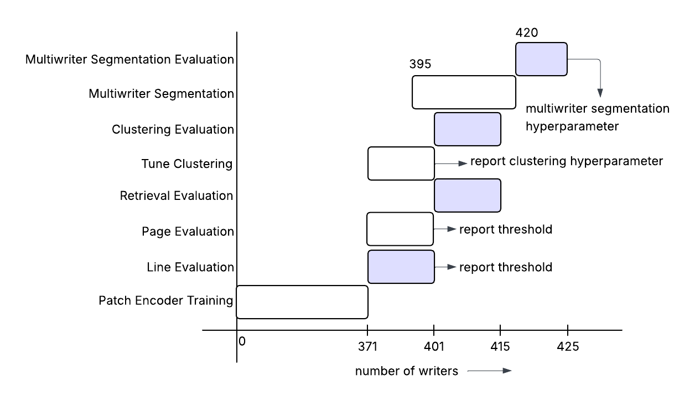

 
 

## 3.2 C. Preprocessing Handwriting Lines 

Before training the encoder model, we preprocess each handwriting line to create perfect content-aware patches. Each patch is a square $128 \times 128$ box. Content-aware patches are those where the majority of the handwriting strokes are effectively captured. These refined patches are then passed to the Encoder. 

To ensure the network learns robust, stroke-level stylistic features rather than memorizing dataset artifacts (e.g., uneven lighting, varying line lengths, or background noise), the raw images pass through a rigorous, geometry-preserving pipeline:

1. **Illumination and Contrast Correction:** The line image is converted to a single-channel grayscale format. To handle the diverse lighting conditions of real-world captures and mobile scans, the background illumination is flattened using a heavy median blur division. This is followed by Contrast Limited Adaptive Histogram Equalization (CLAHE) to amplify faint ink strokes without exacerbating background noise.
2. **Adaptive Masking and Noise Cleanup:** An adaptive Gaussian threshold is applied to isolate the ink. Morphological operations (opening and dilation) are paired with connected-component analysis to filter out stray pixels, scanning artifacts, and isolated noise clusters.
3. **Projection-Based Tight Cropping:** Smoothed horizontal and vertical projection profiles are calculated from the binary mask to mathematically identify the exact bounding box of the text. This step dynamically strips away inconsistent and redundant white margins.
4. **Aspect-Preserving Resize:** The tightly cropped text is resized to a standardized target height. Crucially, the target width is scaled to strictly maintain the original aspect ratio, preventing any geometric distortion of the handwriting angles or loops. The line is then placed onto a fixed-width canvas, utilizing random spatial placement during training to serve as an effective data augmentation strategy.
5. **Content-Aware Extraction and Normalization:** A sliding window extracts $128 \times 128$ patches exclusively from the previously defined text boundaries. Utilizing Otsu's thresholding, the foreground ink density of each patch is evaluated. Patches falling below a minimum ink threshold are discarded to guarantee the CNN only processes highly informative regions. Finally, the extracted patches are normalized to a `float32` range of $[0, 1]$.

The entire process of extracting patches is demonstrated in **Figure 2**.

 
 

## 3.3 D. Fast-Track Patch Encoder Architecture

To extract robust stylistic features from the preprocessed handwriting, we engineered a highly optimized CNN-based "Fast-Track" Patch Encoder. The network accepts $128 \times 128$ single-channel (grayscale) patches and processes them through a highly efficient, three-block convolutional architecture designed to minimize training latency and maximize generalization. 

The progression from image input to the final feature embedding operates as follows:

1. **Block 1: Low-Level Feature Extraction ($128 \times 128 \rightarrow 64 \times 64$)**
   The initial layer consists of 32 convolutional filters ($3 \times 3$ kernel). Instead of utilizing a separate max-pooling layer, this convolution uses a stride of 2 to immediately downsample the spatial dimensions by half. This step drastically reduces the initial computational load (FLOPs). It captures low-level visual cues, such as fundamental ink edges, local contrast, and basic stroke trajectories.

2. **Block 2: Mid-Level Pattern Assembly ($64 \times 64 \rightarrow 32 \times 32$)**
   The second block increases the feature depth to 64 filters, again utilizing a strided convolution to reduce the spatial dimension. This layer combines the fundamental edges identified in Block 1 into more complex geometric structures, such as partial loops, sharp intersections, and the specific curvature of ligature joins.

3. **Block 3: High-Level Style Bottleneck ($32 \times 32 \rightarrow 16 \times 16$)**
   The final convolutional block expands the depth to 128 filters while executing the final spatial reduction. This deep layer captures high-level, abstract stylistic patterns—identifying the micro-textures and structural habits that are unique to a writer but independent of the actual textual content.

*Note on Stability:* Every convolutional block is immediately followed by a Batch Normalization layer (`BatchNorm2d`) and an in-place Rectified Linear Unit (`ReLU`). This ensures stable gradients across diverse datasets, prevents internal covariate shift, and optimizes memory usage on the GPU.

4. **Spatial Reduction and Embedding Generation**
   Instead of flattening the $16 \times 16$ output grid into a massive dense layer (which risks overfitting by memorizing spatial locations), the architecture utilizes Global Average Pooling (`AdaptiveAvgPool2d`). This averages each of the 128 feature maps into a single value, reducing the spatial data into a compact $1 \times 1$ vector. 
   
5. **Final Projection and L2 Normalization**
   The pooled vector is passed through a final linear projection (`fc`) to shape the vector into the target embedding dimension (128). Crucially, this vector is then L2-normalized. By forcing the vector to have a length of exactly 1, the network discards magnitude and focuses entirely on the *direction* of the vector in the latent space.

This final L2-normalized embedding represents the patch's unique stylistic identity. Because it focuses entirely on stroke statistics rather than spatial locations, it acts as a pure, content-independent representation of the author's handwriting style. The entire model architecture is shown in the **Figure 3**

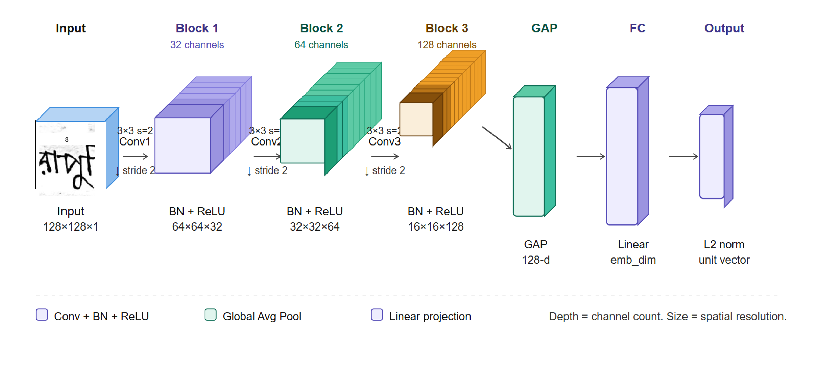

 
 

## 3.4 E. Patch Encoder Model Training Setup

The training pipeline is designed to learn robust, writer-specific feature representations by evaluating how different handwriting samples relate to one another. The core process follows a hierarchical encoding strategy:

1.  **Preprocessing & Extraction:** A raw line image is passed through a preprocessing pipeline to enhance contrast (via CLAHE and illumination correction) and isolate the bounding boxes of actual handwritten content. 
2.  **Patch Generation:** From the isolated content bounds, the system extracts uniform square patches. To ensure a consistent tensor size across batches, the generator enforces a strict limit, randomly sampling exactly **K patches** per line (repeating patches if fewer than K are found). From intense experimenting the value of K is fixed at 8. 
3.  **Patch Encoding:** Each of the 8 patches is passed independently through the `FastPatchEncoder` (a highly optimized CNN). This outputs 8 distinct high-dimensional feature vectors.
4.  **Line Encoding (Pooling & Normalization):** The `FastLineEncoder` aggregates these 8 patch embeddings. It calculates the mean across the patch dimension (Mean Pooling) to create a single, unified representation of the entire text line. Finally, this pooled vector undergoes $L_2$ normalization to project the embedding onto a unit hypersphere. This final normalized vector represents the **Line Embedding**.

---

### Training Objective Function

The model is trained using a **Triplet Loss** function. The data generator constructs batches of triplets consisting of an Anchor (A), a Positive (P) sample from the same writer as the anchor, and a Negative (N) sample from a completely different writer. 

The mathematical representation of the batch-averaged Triplet Loss is defined as:

$$\mathcal{L}_{triplet} = \frac{1}{B} \sum_{i=1}^{B} \max\left(0, \|E(A_i) - E(P_i)\|_2^2 - \|E(A_i) - E(N_i)\|_2^2 + m\right)$$

Where:
* $B$ is the batch size.
* $E(X)$ represents the $L_2$-normalized line embedding generated by the model for an input $X$.
* $\| \cdot \|_2^2$ denotes the squared Euclidean distance between two embedding vectors.
* $m$ is the **margin**, a hyperparameter that enforces a minimum required difference between the positive and negative distances.

Through extensive empirical testing and hyperparameter tuning, a margin of **m = 0.4** was selected as it provided the optimal balance between class separation and training stability.

---

### How Training Optimizes the Model

The goal of the optimization process is to structure the embedding space so that handwriting samples from the same writer cluster together, while samples from different writers are pushed apart.

1.  **Forward Pass:** The Siamese network simultaneously processes the Anchor, Positive, and Negative images, calculating their respective line embeddings and measuring the squared Euclidean distances between them.
2.  **Loss Calculation:** If the Negative sample is closer to the Anchor than the Positive sample (or if it is further away, but not by the required margin of 0.4), the objective function yields a positive loss value. If the model has successfully separated them by at least the margin, the loss is zero (clamped by the `max(0, ...)` function).
3.  **Backward Pass & Update:** Using backpropagation, PyTorch calculates the gradients of this loss with respect to the weights inside the base `FastPatchEncoder`. 
4.  **Adam Optimization:** The Adam optimizer then updates the convolutional weights. Step-by-step, these updates "pull" the Anchor and Positive embeddings closer together on the unit hypersphere while "pushing" the Negative embedding further away, ultimately teaching the CNN to recognize distinct biometric handwriting features rather than arbitrary visual noise.

---

### Optimal Hyperparameters

The following table details the final, tuned hyperparameters that yielded the best accuracy during experimentation:

| Hyperparameter | Value | Description & Optimization Effect |
| :--- | :--- | :--- |
| **Epochs** | 50 | Maximum dataset iterations. Paired with early stopping to prevent overfitting. |
| **Batch Size** | 64 | Number of triplets per step. Provided stable gradients while maximizing Tensor Core efficiency. |
| **Learning Rate** | 0.0005 | Optimizer step size. Allowed for steady convergence without destabilizing the triplet loss. |
| **Embedding Dim** | 512 | The final vector size for the line embeddings. Balanced high expressiveness with computational speed. |
| **Triplet Margin ($m$)** | 0.4 | The required distance buffer between positive and negative pairs. Selected via rigorous experimentation for optimal class separation. |
| **Patches Per Line (K)** | 8 | The number of patches sampled per line. Ensured enough context was captured to represent the writer accurately without stalling training time. |
| **Early Stopping** | 10 | Epochs to wait without validation improvement before halting. Prevented model degradation. |
| **Validation Split** | 0.2 | 20% of unique writers were held out entirely to ensure the model generalized to unseen handwriting styles. |

The training setup is demonstrated in the **Figure 4**

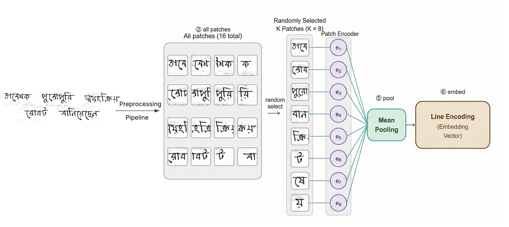

 
 

## 3.5 E. Model Training and Convergence

To train the Fast-Track CNN patch encoder and establish the latent metric space, we utilized the segmented handwriting lines from the training subset of 371 writers, partitioned into an 80/20 writer-disjoint training and validation split (297 train writers and 74 test writers). This strict separation ensured the validation loss reflected true open-set generalization rather than rote memorization.

The network was optimized using a Triplet Loss function (margin = 0.4) to minimize the distance between positive pairs (same writer) and maximize the distance between negative pairs (different writers). Training was executed on a single NVIDIA RTX 3050 GPU, requiring approximately 13 minutes and 15 seconds per epoch, with a total training duration of nearly 12 hours. 

As illustrated in the loss convergence curve (**Figure 5**), the model demonstrated steady learning. The optimal weights were captured at **Epoch 36**, achieving the lowest validation loss of $0.039489$. Following this peak, the validation loss stabilized without further improvement, triggering an early stopping mechanism (patience of 10) at Epoch 46 to actively prevent overfitting.

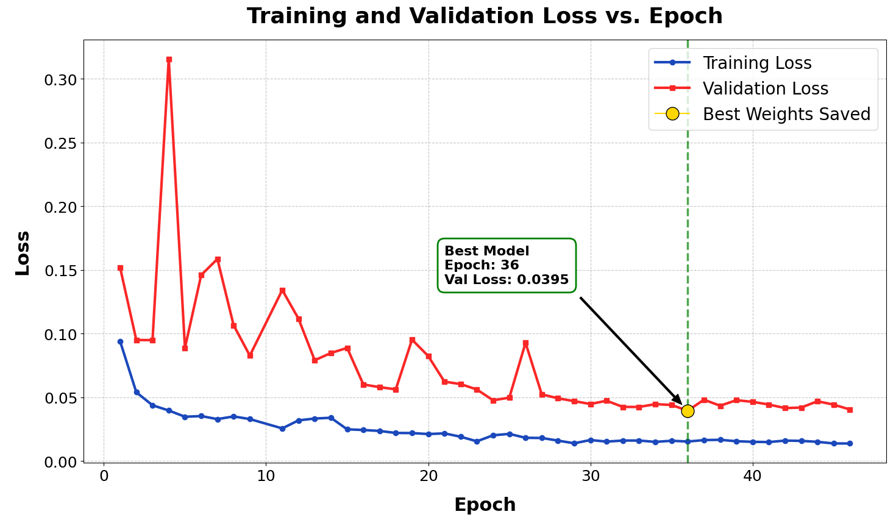

 
 

## 3.6 F. Metric Space Calibration and Threshold Selection

To calibrate the latent metric space and establish optimal decision boundaries, we evaluated the model using line-level and page-level handwriting from the tuning subset (Writers 372–403). We performed a comprehensive threshold sweep across cosine distances to determine the precise cutoff point for classifying whether two writing samples belong to the same writer.

To ensure the evaluation was entirely free from class-imbalance bias, we constructed perfectly balanced test sets: the line-level evaluation utilized 500 positive (same-writer) and 500 negative (different-writer) pairs, while the page-level evaluation utilized 100 positive and 100 negative pairs. Across these sweeps, we monitored standard verification metrics, including Accuracy, Precision, Recall, F1-score, FPR, FNR, and AUC. 

We established our final binary decision threshold exactly at the operating point where **Precision equals Recall**. Based on this criterion, the optimal cosine distance threshold was determined to be **0.300667** for line-level comparison and **0.204000** for page-level comparison. If the cosine distance between two handwriting embeddings is strictly less than the respective threshold, the samples are classified as originating from the same writer; otherwise, they are considered to be from different writers. The performance dynamics across all evaluated thresholds for the line-level and page-level sweeps are illustrated in **Figure 6** and **Figure 7**, respectively.

Selecting the Precision = Recall intersection is particularly critical for forensic verification systems. Operating on a balanced dataset, this specific point mathematically ensures a symmetric error penalty. It actively balances the risk of falsely attributing a document to the wrong writer (False Positives) against the risk of failing to detect a legitimate match (False Negatives), providing a highly robust and trustworthy calibration for real-world deployment.

 
 

## 3.7 G. Line and Page Level Inference

Once the metric space is calibrated, the system can perform open-set verification on completely unseen handwriting samples. The inference pipeline processes comparisons at two distinct hierarchical levels:

**1. Line-Level Inference**
When comparing two isolated handwriting lines, both images are processed independently through the established preprocessing pipeline to extract content-aware patches. These patches are passed through the frozen Fast-Track Patch Encoder to generate individual patch embeddings. To form a single representation of the line, these patch embeddings are mean-pooled and strictly L2-normalized. The system then calculates the cosine distance between the two final line descriptors. If the distance is below the calibrated threshold of **0.300667**, the system confidently verifies them as the same writer. The complete line-level inference pipeline is illustrated in **Figure 7**.

**2. Page-Level Inference**
Page-level inference automates the extraction of lines before generating the final embedding. Given a full handwritten document, the system utilizes EasyOCR to detect word-level bounding boxes. To robustly handle skewed handwriting and irregular baselines common in real-world data, words are grouped into lines using an adaptive vertical tolerance algorithm (dynamically set to 50% of the preceding word's height). 

Once the page is cropped into segmented lines, each line is processed through the line-level pipeline to generate its own L2-normalized line embedding. Finally, all line embeddings from the document are mean-pooled together and L2-normalized to construct a single, highly robust page-level embedding. The cosine distance between two page embeddings is evaluated against the stricter threshold of **0.204000** to make the final verification decision. The page-level inference pipeline is illustrated in **Figure 8**. 

 
 

## 3.8 H. Writer-Based Document Retrieval (1-to-Many Search)

Writer-based document retrieval addresses a critical challenge in forensic analysis and archive digitization: automatically extracting all documents written by a specific author from a massive, unorganized database, using only a single reference manuscript. Unlike binary 1-to-1 verification, this requires a robust 1-to-Many vector similarity search.

To execute this search, our system first processes the queried reference page through the Fast-Track Patch Encoder to generate its unique, L2-normalized page embedding. We then systematically scan the target database, extracting and caching the page embeddings for every document in the pool. By computing the cosine distance between the query embedding and every embedding in the database, we can automatically isolate matches. Any document yielding a distance strictly below our calibrated page-level threshold (0.204000) is classified as a match, copied, and isolated into a consolidated results directory. The process is demonstrated in the **Figure 9**

#### 1. Evaluating Document Retrieval

To rigorously quantify the effectiveness of our 1-to-Many retrieval system, we evaluated the pipeline on the completely unseen testing subset of 12 writers (Writers 404–415). Rather than performing a single static search, we simulated a realistic database environment by segmenting and embedding every available page within this subset to form a comprehensive, unstructured evaluation pool. We then executed multiple randomized query trials ( 20 in this case) to ensure statistical robustness. For each trial, we randomly selected a single page from the pool to serve as the reference query, mimicking a real-world scenario where an investigator possesses only one verified handwriting sample. 

During each trial, we exhaustively compared the reference embedding against the embeddings of all other pages remaining in the pool. We classified matches strictly using our calibrated page-level cosine distance threshold of 0.204000, automatically retrieving any document that fell below this boundary. By aggregating these automated predictions against the ground-truth writer identities across all randomized trials, we systematically tracked our true positive and false positive retrieval rates. This dynamic approach allowed us to calculate highly reliable performance metrics—including Accuracy, Precision, Recall, F1-Score, and AUC—demonstrating the system's viability for automated archival sorting and forensic extraction.

 
 

### 3.9 I. Unsupervised Document Clustering (The "Master Sorter")

Document clustering addresses the complex challenge of organizing a completely unstructured archive of handwritten documents by writers handwriting. Unlike verification or retrieval—which rely on a known reference sample—clustering operates entirely unsupervised. Its objective is to automatically group a mixed, unorganized collection of pages into distinct clusters, where each cluster represents a single unique (but anonymous) writer. This "Master Sorter" capability is invaluable for historians or forensic analysts tasked with cataloging massive caches of undocumented manuscripts without any prior knowledge of the authors. The process is shown in the **Figure 10.**

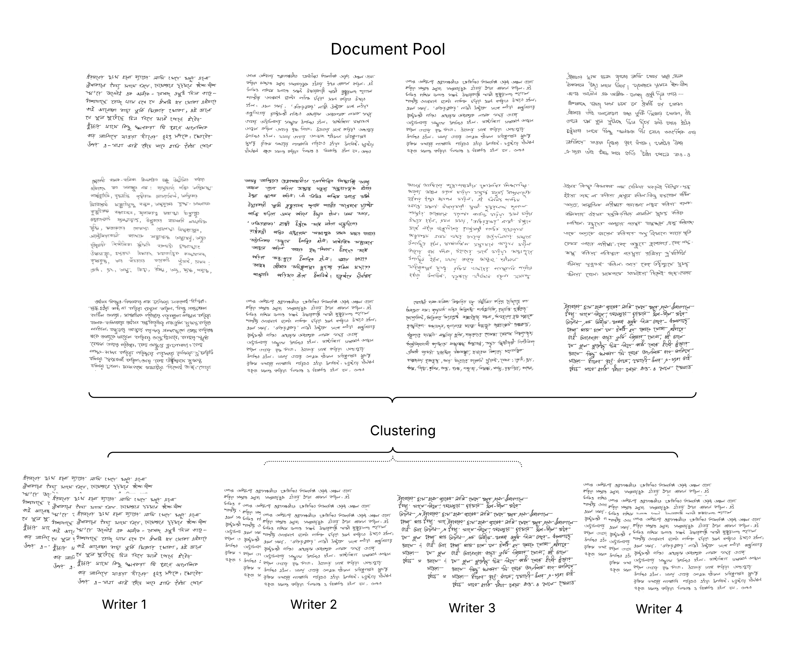

#### 1. Tuning the Clustering Algorithm

To implement this system, we utilized Density-Based Spatial Clustering of Applications with Noise (DBSCAN). DBSCAN is exceptionally well-suited for handwriting clustering because it does not require us to predefine the total number of writers (clusters) in the dataset, and it inherently isolates highly anomalous or erratic documents as "noise" rather than forcing them into incorrect groupings.

We tuned the DBSCAN algorithm using our dedicated tuning subset (Writers 372–403). First, we generated L2-normalized page embeddings for all documents in the subset and computed a complete pairwise cosine distance matrix. We then conducted a systematic grid search across the core hyperparameters: the maximum spatial neighborhood distance (`eps`) and the minimum density requirement (`min_samples`). We evaluated each configuration by translating the cluster assignments into a pairwise classification task—optimizing for the configuration that maximized the correct grouping of same-writer pairs while minimizing false associations. The hyperparameter tuning dynamics and the convergence on the optimal settings are demonstrated in **Figure 11**.

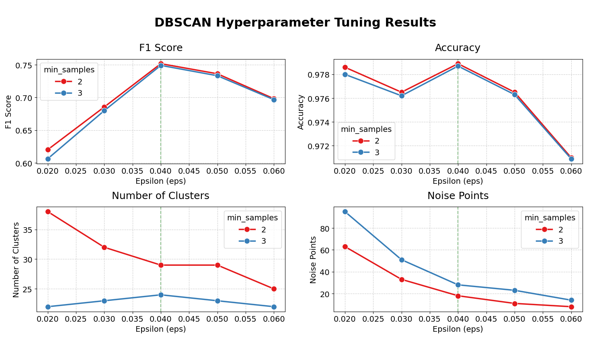

#### 2. Evaluating Clustering Performance

To validate the generalizability of our clustering pipeline, we evaluated the system on the completely unseen Testing Set (Writers 404–415). We embedded all pages within this subset, computed the unified pairwise distance matrix, and applied DBSCAN utilizing the optimal hyperparameters established during the tuning phase. 

Because clustering is an unsupervised task, we structured our evaluation using a rigorous pairwise classification framework. We constructed a binary ground-truth matrix representing all possible document pairs in the testing pool, indicating whether each pair truly shared an author. We then compared this against a binary prediction matrix derived from the DBSCAN output, which indicated whether the algorithm successfully placed the two documents into the same non-noise cluster. By systematically cross-referencing these matrices to track true positives, false positives, true negatives, and false negatives across all possible pairings, we were able to comprehensively quantify the system's sorting efficacy. The final metrics derived from this evaluation are detailed in the subsequent Results section.

 
 

## 3.10 J. Multi-Writer Segmentation (Intrinsic Plagiarism Detection)

Multi-writer segmentation addresses the complex task of identifying distinct authorship boundaries within a handwritten document. This capability forms the core of **intrinsic plagiarism detection**. Standard plagiarism checks rely on comparing a suspicious document against an external reference database. In contrast, intrinsic detection analyzes the internal stylistic consistency of the document itself. By autonomously identifying sudden, unauthorized shifts in handwriting style across consecutive lines or paragraphs, the system can flag sections that were forged or completed by an unauthorized collaborator.

To execute multi-writer segmentation on a single page, we first segment the document into individual lines and extract a sequence of L2-normalized line embeddings. We then apply local DBSCAN clustering to group stylistically similar lines. Because local clustering can occasionally produce single-line anomalies (due to OCR errors or short text lengths), we refine the chronological sequence of cluster IDs using two sequential operations: **smoothing** and **compression**. 

First, smoothing applies a moving majority filter to correct isolated errors. For example, if a stray line from Writer 0 is misclassified amidst a block of Writer 1's text (e.g., `[1, 1, 0, 1, 1]`), the moving window corrects the anomaly back to `[1, 1, 1, 1, 1]`. Second, compression collapses consecutive identical labels into a single block and entirely discards unclusterable noise vectors (`-1`). For instance, a smoothed sequence of `[0, 0, 0, -1, 1, 1]` is compressed into a clean, sequential map: `[0, 1]`. This isolated, compressed sequence represents the true underlying pattern of authorship shifts. The complete multi-writer segmentation pipeline is illustrated in **Figure 12**.

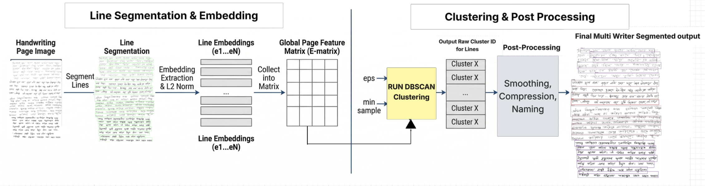

#### 1. Tuning the Segmentation Pipeline

To calibrate the temporal and stylistic sensitivity of this pipeline, we utilized handwritten pages from a dedicated tuning subset of 25 writers (Writers 396–420). From this subset, we synthesized 196 specialized multi-writer documents by cutting and merging segments from different authors, resulting in documents containing one, two, three, or four distinct writers. **Figure 13** illustrates examples of these synthesized multi-writer documents alongside the output of our segmentation pipeline.

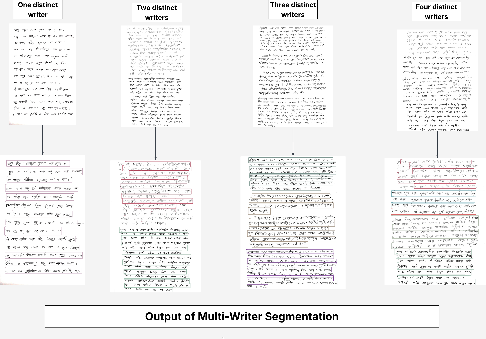

We optimized the pipeline via a comprehensive grid search over the core DBSCAN hyperparameters (maximum spatial distance `eps` and `min_samples`) as well as the chronological smoothing `window_size`. Because unsupervised clustering assigns arbitrary, anonymous cluster IDs, we first mapped the predicted sequence of cluster IDs to the chronological Ground Truth sequence based strictly on their order of appearance on the page. 

Our primary objective metric for this tuning was the **Sequence Error Rate (SER)**. The SER quantifies the magnitude of segmentation errors by measuring the Levenshtein (edit) distance $D$ between the predicted writer sequence and the ground truth writer sequence, normalized by the length of the ground truth sequence $N$:

$$SER = \frac{D(Predicted, GroundTruth)}{N}$$

The Levenshtein distance itself is defined mathematically as the minimum number of single-element edits—insertions, deletions, or substitutions—required to transform one sequence into the other. By minimizing the SER across the 196 tuning pages, we established our optimal hyperparameters, which successfully filtered out localized noise and achieved a minimal tuning SER of 0.1203. The optimized hyperparameter configuration is detailed in **Table VI**.

**Table VI: Optimized Hyperparameters for Multi-Writer Segmentation**

| Parameter | Function | Optimal Value |
| :--- | :--- | :--- |
| `eps` | Maximum cosine distance between lines in the same cluster | 0.09 |
| `min_samples` | Minimum number of lines required to form a valid writer cluster | 3 |
| `window_size` | Size of the moving majority vote window for sequence smoothing | 5 |

#### 2. Evaluating Multi-Writer Segmentation

To rigorously evaluate the system's ability to detect intrinsic plagiarism on unseen data, we utilized a strictly disjoint evaluation subset consisting of 97 newly synthesized multi-writer pages. 

For the evaluation protocol, we processed each document independently using our fully automated pipeline. The lines were segmented, embedded, clustered using the optimal DBSCAN parameters (`eps` = 0.09, `min_samples` = 3), and smoothed using the 5-line sliding window. After mapping the compressed predictions to the ground truth format, we evaluated the pipeline by comparing these sequences against the complex true sequences of the 97 test pages. Our performance was quantified using the overall **Sequence Error Rate** and the **Absolute Sequence Accuracy** (the percentage of documents where the predicted sequence perfectly matched the true sequence with zero edit distance). The quantitative results are detailed in the subsequent Results section.

#### 3. Intrinsic Plagiarism Detection Across Assignments

To verify the authorship integrity of multi-page submissions (e.g., detecting unauthorized collaboration), we adapted our segmentation framework into a continuous intrinsic plagiarism detection pipeline using an online, centroid-tracking algorithm. As the system sequentially processes lines across an assignment, the initial embedded line establishes the primary writer's centroid in the latent space. Subsequent lines are continuously compared against known centroids using our calibrated line-level threshold; matches dynamically update the centroid to accommodate natural handwriting variations, while embeddings exceeding the threshold trigger the creation of a new writer profile. If the scan concludes with a writer count greater than one, the system automatically triggers a plagiarism flag and outputs color-coded, annotated pages to provide immediate visual evidence of the fraudulent stylistic shifts for forensic review.

 
 

---
---

# 4. Results:

## 4.1 A. Line and Page Level Writer Verification Evaluation Results

As established during the metric space calibration (detailed in 3.6 Metric Space Calibration and Threshold Selection) , the verification pipeline was evaluated using perfectly balanced pair samples from the tuning subset (Writers 372–403). The evaluation utilized 1,000 line-level pairs (500 positive, 500 negative) and 200 page-level pairs (100 positive, 100 negative). Pairs were classified using the optimal cosine distance thresholds established during our tuning phase (**0.300667** for line-level and **0.204000** for page-level).

To quantify the model's verification capabilities, the system's predictions were categorized into four foundational outcomes:
* **True Positive (TP):** Handwriting pairs from the *same* writer correctly verified as a match.
* **True Negative (TN):** Handwriting pairs from *different* writers correctly identified as a non-match.
* **False Positive (FP):** Handwriting pairs from *different* writers incorrectly verified as a match (False Acceptance).
* **False Negative (FN):** Handwriting pairs from the *same* writer incorrectly identified as a non-match (False Rejection).

The exact distribution of these predictions—the raw TP, TN, FP, and FN counts for both the line-level and page-level evaluations—is visualized in the confusion matrices presented in **Figure 15**.

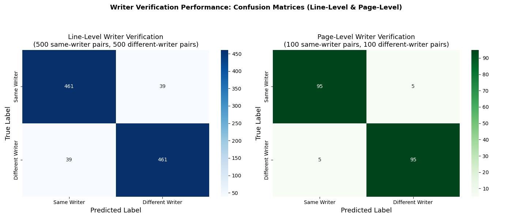

Based on these foundational counts, we derived standard verification metrics (Accuracy, Precision, Recall, F1-Score, AUC, FPR, and FNR) to comprehensively quantify model performance. 

The quantitative results of this evaluation are summarized in **Table VII**. Because the decision thresholds were explicitly pinned to the intersection of Precision and Recall on perfectly balanced test sets, the Error Rates (FPR and FNR) are structurally symmetric. This confirms that the system maintains a strict, mathematically balanced risk profile without favoring false acceptances over false rejections.

**Table VII: Verification Performance at the Precision = Recall Threshold**

| Metric | Line-Level Verification | Page-Level Verification |
| :--- | :--- | :--- |
| **Accuracy** | 0.9220 | 0.9500 |
| **Precision** | 0.9220 | 0.9500 |
| **Recall** | 0.9220 | 0.9500 |
| **F1-Score** | 0.9220 | 0.9500 |
| **AUC** | 0.9719 | 0.9827 |
| **FPR (False Acceptance Rate)** | 0.0780 | 0.0500 |
| **FNR (False Rejection Rate)** | 0.0780 | 0.0500 |

 
 

## 4.2 B. Writer-Based Document Retrieval Evaluation Results

As detailed in Section 3.8(H), we evaluated the 1-to-Many retrieval pipeline on a completely unseen testing subset of 12 writers (138 total pages). To simulate a realistic archival search, we executed 20 randomized query trials. In each trial, a single reference page queried the remaining unstructured pool, automatically retrieving documents with a cosine distance strictly below the 0.204000 threshold. 

To quantify the system's retrieval efficacy across all trials, every document in the pool was categorized into one of four outcomes:
* **True Positive (TP):** Documents by the queried writer that were correctly retrieved.
* **True Negative (TN):** Documents by different writers that were correctly ignored.
* **False Positive (FP):** Documents by different writers that were incorrectly retrieved.
* **False Negative (FN):** Documents by the queried writer that the system failed to retrieve (missed documents).

The exact distribution of these predictions—detailing the aggregated TP, TN, FP, and FN counts across all randomized trials—is visualized in the confusion matrix presented in **Figure 16**.

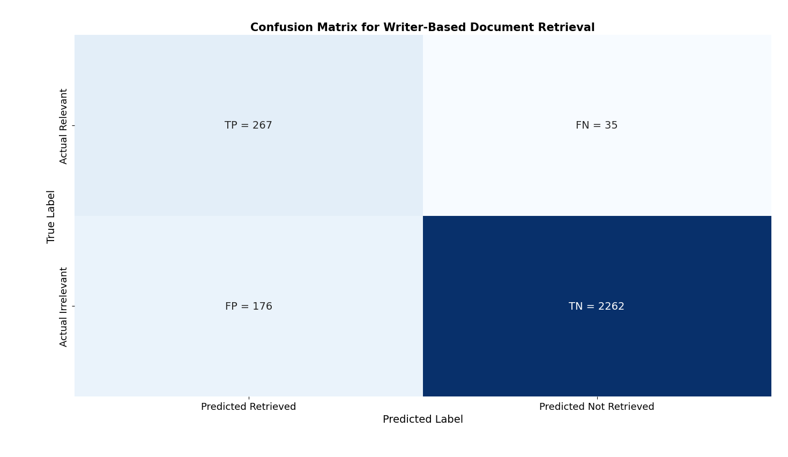

By aggregating these outcomes across all 20 trials, we calculated the system's overall performance. The resulting metrics are summarized in **Table VIII**.

**Table VIII: Writer-Based Document Retrieval Performance (20 Trials)**

| Metric | Evaluation Result |
| :--- | :--- |
| **Accuracy** | 0.9230 |
| **Precision** | 0.6027 |
| **Recall** | 0.8841 |
| **F1-Score** | 0.7168 |
| **AUC** | 0.9647 |
| **False Positive Rate (FPR)** | 0.0722 |
| **False Negative Rate (FNR)** | 0.1159 |

 
 

## 4.3 C. Unsupervised Document Clustering Evaluation Results

As outlined in Section 3.9, the unsupervised clustering pipeline was evaluated on a completely unseen testing subset of 12 writers, comprising 138 total pages. Using the optimal DBSCAN hyperparameters established during tuning (`eps` = 0.0400, `min_samples` = 2), the algorithm processed the unified pairwise distance matrix to automatically group the unorganized documents. 

To rigorously quantify this unsupervised task, we evaluated the output using a pairwise classification framework. Every possible combination of document pairs was analyzed and categorized into one of four outcomes:
* **True Positive (TP):** Documents written by the *same* author correctly grouped into the *same* cluster.
* **True Negative (TN):** Documents written by *different* authors correctly separated into *distinct* clusters.
* **False Positive (FP):** Documents written by *different* authors incorrectly grouped into the *same* cluster.
* **False Negative (FN):** Documents written by the *same* author incorrectly separated into *distinct* clusters (or discarded as unclusterable noise).

The exact distribution of these pairwise predictions—detailing the aggregated True Positive, True Negative, False Positive, and False Negative pairings—is visualized in the confusion matrix presented in **Figure 17**.

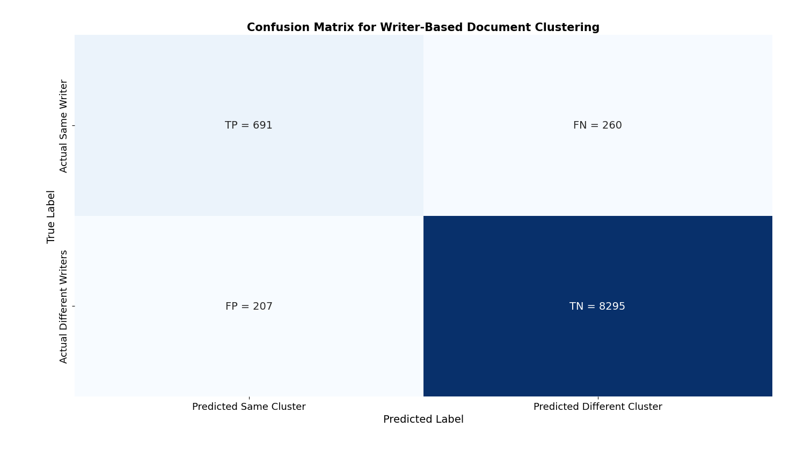

From the 138 pages, the DBSCAN algorithm successfully identified 13 distinct clusters and isolated 23 highly anomalous pages as noise. By aggregating the pairwise outcomes across the entire testing pool, we derived the comprehensive classification metrics summarized in **Table IX**.

**Table IX: Unsupervised Document Clustering Performance (Pairwise Evaluation)**

| Metric | Evaluation Result |
| :--- | :--- |
| **Accuracy** | 0.9506 |
| **Precision** | 0.7695 |
| **Recall** | 0.7266 |
| **F1-Score** | 0.7474 |
| **AUC** | 0.9713 |
| **False Positive Rate (FPR)** | 0.0243 |
| **False Negative Rate (FNR)** | 0.2734 |

 
 

## 4.4 D. Multi-Writer Segmentation Evaluation Results

As outlined in Section 3.10(J), we evaluated the multi-writer segmentation pipeline on a strictly disjoint testing subset of 97 newly synthesized multi-writer pages. Each document was processed through the automated pipeline utilizing the optimized parameters established during tuning (`eps` = 0.09, `min_samples` = 3, `window_size` = 5). The raw line-level cluster assignments were smoothed and compressed to extract the final chronological sequence of authorship shifts, completely filtering out localized noise.

To quantify the system's proficiency in intrinsic plagiarism detection, these predicted sequences were evaluated against the complex ground-truth sequences of the test documents. Performance was measured using two strict metrics:
* **Sequence Error Rate (SER):** The average magnitude of segmentation errors across all pages, calculated via the normalized Levenshtein edit distance. 
* **Absolute Sequence Accuracy:** The percentage of total documents where the system's predicted sequence perfectly matched the ground-truth sequence with zero edit distance (no insertions, deletions, or substitutions required).

The quantitative results of this evaluation are summarized in **Table X**, demonstrating the pipeline's strong capability to autonomously map internal stylistic shifts.

**Table X: Multi-Writer Segmentation Performance (97 Test Pages)**

| Metric | Evaluation Result |
| :--- | :--- |
| **Average Sequence Error Rate (SER)** | 0.0851 |
| **Absolute Sequence Accuracy** | 76.29% |

 
 

---
---

# 5. Discussion

In this research, we set out to build a comprehensive, all-in-one handwritten document intelligence framework specifically designed to handle the intricate complexities of the Bangla script. At the core of our ecosystem is the writer verification pipeline. When evaluated on perfectly balanced positive (same writer) and negative (different writer) pairs from completely unseen test subjects, our framework achieved a line-level accuracy of **92.20%** (AUC: 0.9719) and a page-level accuracy of **95.00%** (AUC: 0.9827).

When we compare these results to our preliminary work published at ICCIT, we see a meaningful evolution in our model's capability. Our line-level accuracy improved notably from 90.10% to 92.20%. However, we did observe a slight reduction in page-level accuracy, shifting from 97.0% in our previous study to 95.00%. Rather than a regression, we view this as a necessary and highly practical trade-off. Our preliminary model was trained and evaluated on a highly sanitized, idealized dataset. For this current framework, we intentionally challenged our architecture by training it on a massively scaled dataset filled with severe real-world complexities—such as low-quality mobile scans, paper impurities, diverse background colors, and skewed line orientations—and tested it across a much larger pool of unseen writers. Consequently, our current model is vastly more robust. This 95.00% accuracy represents a true, field-ready metric capable of handling real-world noise, rather than an artifact of a perfectly clean laboratory dataset.

Because we successfully engineered such a stable, content-independent metric space, we were able to seamlessly extend our framework into complex operational tasks that go far beyond simple 1-to-1 verification. In our zero-shot **Document Retrieval** evaluation, the system achieved an accuracy of **92.30%** and an AUC of 0.9647. This proves that our biometric embeddings are highly discriminative, allowing investigators to accurately isolate all matching manuscripts from an unstructured pool using just a single reference document. 

Similarly, our unsupervised **Document Pool Clustering** pipeline achieved a pairwise classification accuracy of **95.06%** (AUC: 0.9713). This confirms that our shared encoder space can act as an autonomous "Master Sorter," capable of cataloging massive caches of anonymous historical or forensic manuscripts without any prior writer enrollment.

Perhaps our most novel contribution is the **Multi-Writer Segmentation** pipeline. By applying our embeddings to the highly complex task of intrinsic plagiarism detection, we achieved an average Sequence Error Rate (SER) of just **0.0851**, which translates to a highly effective sequence mapping correction rate of **91.49%**. Even more stringently, our system achieved an Absolute Sequence Accuracy of **76.29%**. This means our pipeline perfectly reconstructed the exact chronological sequence of authorship shifts—with zero edit distance errors—in over three-quarters of the tested multi-author documents.

Ultimately, this framework realizes our primary research goals. We successfully transitioned our work from isolated, clean-data verification experiments into a highly robust, multi-task ecosystem. By providing a fully reproducible pipeline capable of executing verification, retrieval, clustering, and intrinsic plagiarism detection under strict open-set conditions, we have contributed a highly practical, field-ready toolset for forensic document examiners, historical archivists, and academic integrity boards.

---
---

# 6. Conclusion

In this research, we successfully developed and evaluated a comprehensive, end-to-end handwritten document intelligence framework tailored for the complex Bangla script. Moving beyond traditional, isolated verification tasks, we engineered a highly optimized "Fast-Track" Patch Encoder and trained it on a massively scaled, real-world dataset of 435 writers. By learning a deeply generalized, content-independent metric space, our system not only achieved highly accurate line and page-level verification (92.20% and 95.00%) under strict open-set conditions but also seamlessly facilitated advanced operational tasks. 

We demonstrated the framework's capability to successfully perform zero-shot 1-to-many document retrieval, unsupervised archival pool clustering, and a completely novel multi-writer segmentation pipeline for intrinsic plagiarism detection, all maintaining exceptional accuracy on completely unseen data.

Ultimately, this work transitions automated handwriting analysis from a controlled laboratory experiment into a highly robust, field-ready forensic toolset. By providing a fully reproducible, multi-task ecosystem that thrives on noisy, real-world data, we have established a scalable and practical foundation for the automated forensic analysis, historical archiving, and academic integrity enforcement of complex handwritten scripts globally.

