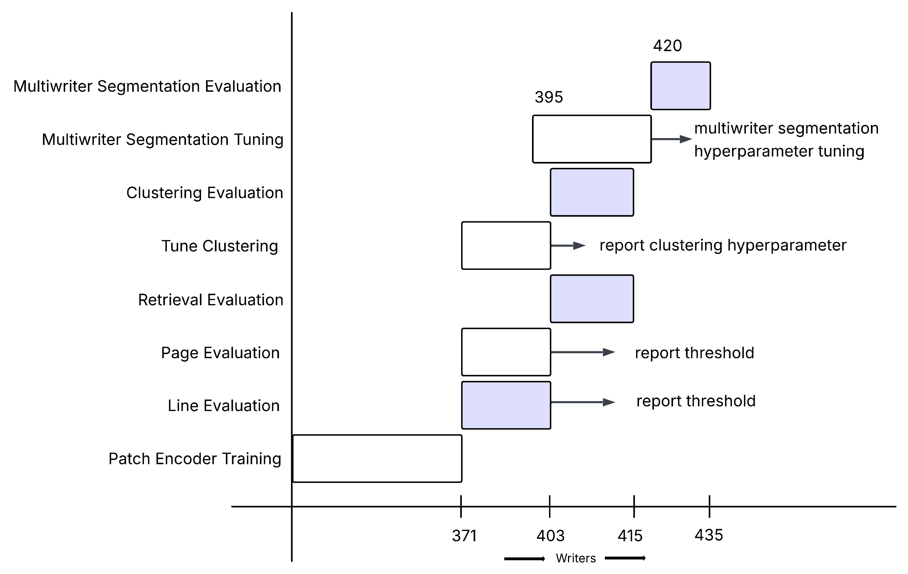
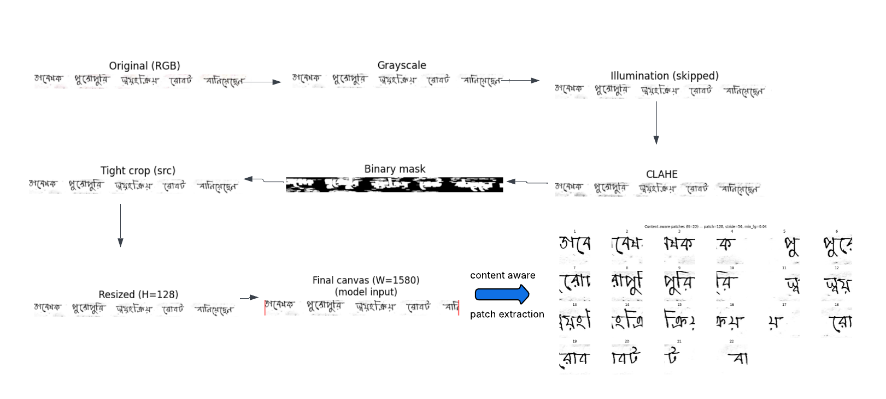
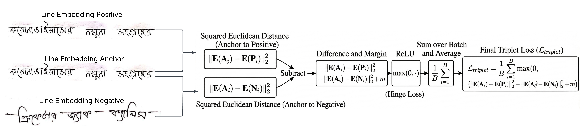
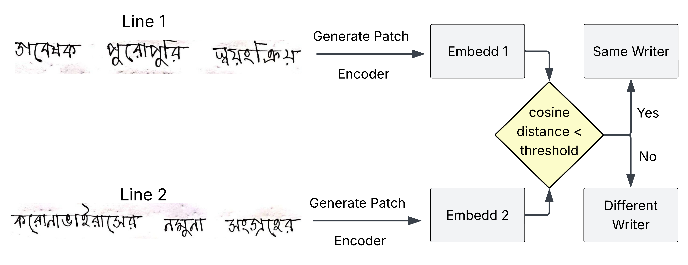
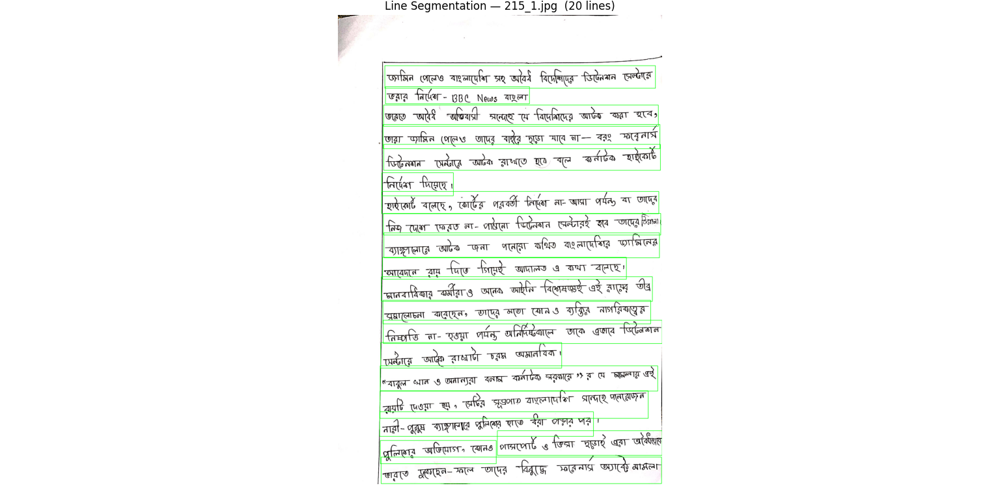
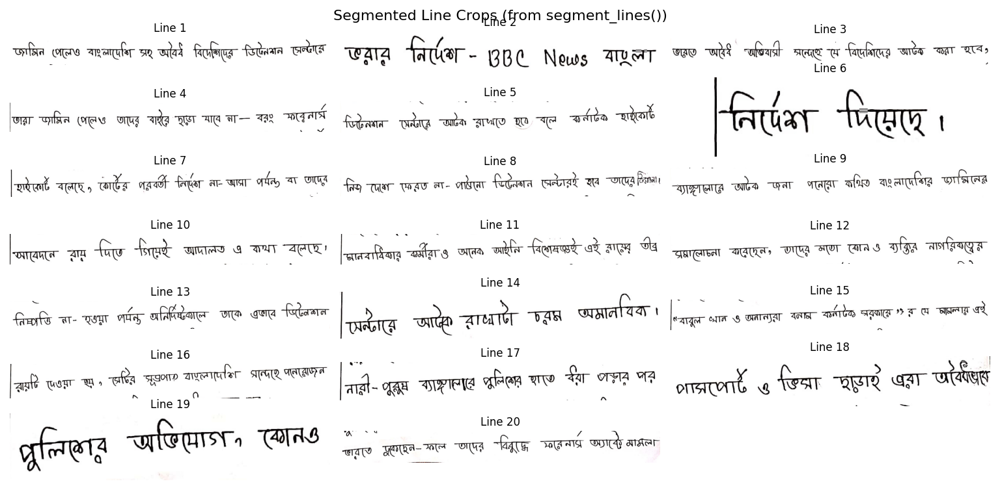
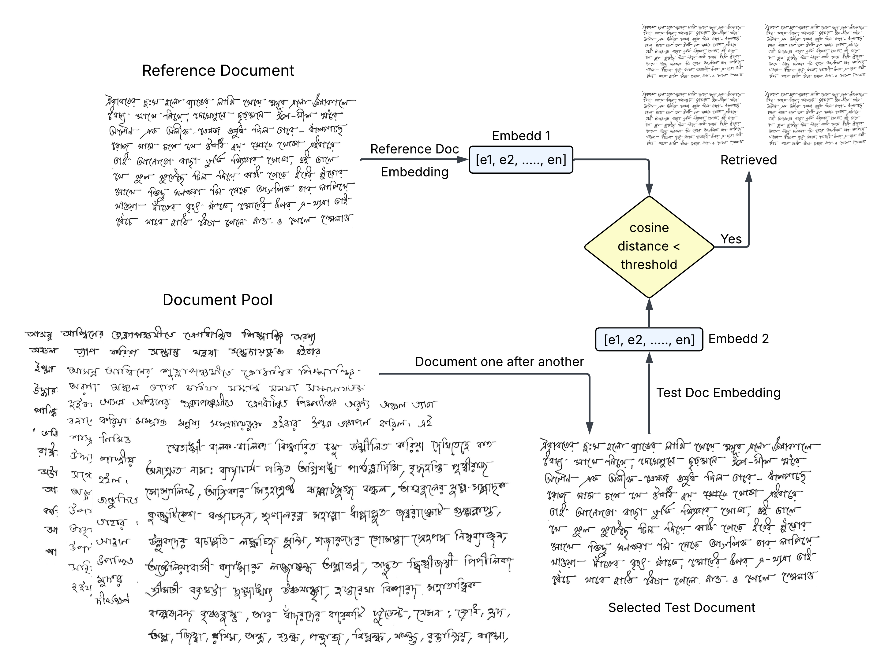

# A Unified Framework for Open-Set Bengali Handwriting Analysis:

<div align="center">

[](https://www.python.org/)
[](https://pytorch.org/get-started/locally/)
[](https://developer.nvidia.com/cuda-toolkit-archive)
[](https://developer.nvidia.com/rdp/cudnn-archive) <br>
[](https://github.com/ArfatulAsif/A-Unified-Framework-for-Bengali-Handwriting-Analysis#license)
[](https://github.com/ArfatulAsif/A-Unified-Framework-for-Bengali-Handwriting-Analysis/pulls)
[](https://github.com/ArfatulAsif/A-Unified-Framework-for-Bengali-Handwriting-Analysis/graphs/contributors)

</div>

<br>

## Writer Verification (Line-level, Patch Pooling) and (Page-level, Line Pooling):

WRITER verification (1:1 matching) determines whether two different handwriting samples were authored by the same person.


## Page document Retrieval based on writers handwriting:

Writer retrieval (1:N search) involves taking a single query document and ranking a vast database of other documents based on their stylistic similarity. 


## Document Clustering based on writers:

Writer-based document clustering is an unsupervised task that groups a massive, unlabelled stack of documents according to their distinct, unknown authors based on handwriting style only. 

## Sequential multi-writer segmentation

Sequential multi-writer segmentation is the task of detecting whether a single document page is written by multiple writers mapping the exact chronological order of multiple distinct authors collaborating on a single, continuous page.


# Folder Order


**1. data**

**2. preprocessing**

**3. modeling**

**4. reports**

**5. trained_model**

**6. line_comparison**

**7. page**

**8. retrieval**

**9. reports_retrieval**

**10. Clustering_Agglomerative**

**11. reports_clustering**

**12. multi_writer**

**13. reports_multi_writer_segmentation**

**14. Ablation study**


<br>


---
---
---


# All Pipelines:


# 0. Setup environment


### Create virtual envorntment

```
conda create --name "pt-gpu"
```

```
conda activate pt-gpu
```

### For faster training/testing/using the system on NVIDIA GPU:

#### Setup-NVIDIA-GPU-for-Deep-Learning

##### Step 1: NVIDIA Video Driver

You should install the latest version of your GPUs driver. You can download drivers here:
 - [NVIDIA GPU Drive Download](https://www.nvidia.com/Download/index.aspx)

##### Step 2: Visual Studio C++

You will need Visual Studio, with C++ installed. By default, C++ is not installed with Visual Studio, so make sure you select all of the C++ options.
 - [Visual Studio Community Edition](https://visualstudio.microsoft.com/vs/community/)

##### Step 3: Anaconda/Miniconda

You will need anaconda to install all deep learning packages
 - [Download Anaconda](https://www.anaconda.com/download/success)

##### Step 4: CUDA Toolkit

 - [Download CUDA Toolkit](https://developer.nvidia.com/cuda-toolkit-archive)

##### Step 5: cuDNN

 - [Download cuDNN](https://developer.nvidia.com/rdp/cudnn-archive)

Copy cuDNN libraries into CUDA libraries.

##### Step 6: Install PyTorch 

 - [Install PyTorch](https://pytorch.org/get-started/locally/)

Modeling of this system was done using PyTorch. This is due to the hardship of training with tensorflow on gpu. As cuda version or cuDNN version doesn't always match for tensorflow, so it was feasible to just use PyTorch.

##### Finally run the following script to test your GPU

```bash
python -m modeling.gpu
```

##### For training this project the following was used:

**CUDA VERSION: 12.8**

**cuDNN Version: 8.9.7**

**python 3.9.13**

**PyTorch stable (2.8.0)**


### Install

```bash
pip install -r requirements.txt
```


---


<br>
<br>

# 1. data


### Dataset folder structure

```
./data/Train/<writer_id>/<doc_id>/*.jpg       --- line dataset
./data/Test/<writer_id>/<doc_id>/*.jpg        --- line dataset
./data/Evaluate_For_Pages/<writer_id>/*.jpg   --- page dataset
./data/Test_For_Pages/<writer_id>/*.jpg       --- page dataset
./data/Multi_Writer/Tune_pages/page_writer_sequence*.jpg       --- multi writer page dataset
./data/Multi_Writer/Test_pages/page_writer_sequence*.jpg       --- multi writer page dataset
```

You can customize dataset and use datatype: ".jpg", ".jpeg", ".png", ".bmp", ".tif", ".tiff" .


The `data` folder here contains only a few samples of each type. The full dataset is available upon reasonable request.


### Dataset split (a total of 435 writers):


<br>



<br>


### `dataset.py` : 


1. `index_writer_images` function indexes lines by writers.

2. `split_writers` function splits Train data to train and validation set. (80%, 20%). Here train and validation set wrtiers are completely disjoint.

3. `sample_two_distinct` function takes items as input and retuns random two items. 


### Role : 

The role of this pipeline is to properly index dataset (lines) by writers from the directory. Split writers into train + validation set. 


<br>
<br>


# 2. preprocessing 


### `pipeline.py` 

<br>



<br>


### Visualize preprocessing pipeline (Preprocessing + Extract Patches):


```bash
python -m preprocessor.view_preprocessor --file ./data/Train/10/10_1/10_1_1.jpg --show-patches
```

<br>

# 3. modeling


### Model Architecture : `model_defs.py`


**Patch Encoder (CNN)**


<br>


**Line Encoder + Triplet Siamese**

<br>




<br>


### Training : `train.py`


**Start training**

```bash
python -m modeling.train
```

- Model weights is saved into `./trained_model`.
- Check the `config.yml`, If training a new model, make sure to change the name of the `["path"]["base_encoder_weights"]` 


### Evaluate : `evaluate.py`


**Start evaluation:**

<br>

```bash
python -m modeling.evaluate
```

This builds same-writer pairs and balanced different-writer pairs, computes distances,
sweeps a threshold, and prints Accuracy, Precision/Recall/F1, FAR/FRR, and AUC. Also plots graph ((acc, precision, recall, f1, AUC, FPR, FNR)  vs threshold)


<br>


# 4. reports 


### `./reports` : folder contains report of base encoder training and epoch and evaluation reports


# 5. trained_model

We saved trained models and best check points during epochs.

`Complete_New_CNN_DPE_NET.pt` is our trained proposed DPE-NET model.

`Complete_fasternet_t0.pt` is the trained pretrained fasternet_t0 model.


# 6. line_comparison


```bash
python -m line_comparison.predict --config config.yml --img_a ./path/to/img1.jpg --img_b ./path/to/img2.jpg
```


<br>



<br>


# 7. page


### segment_lines : `segment_lines.py`





### `show_lines_segmentation.py`


```bash
python -m page.show_lines_segmentation  ./path/to/page/image.jpg
```


   


### Page Embedding : `page_embeding.py`

It creates page level embeddings for each page.


### Evaluate Page Comparison : `evaluate.py`

```bash
python -m page.evaluate
```


### Use Page comparison to verify two pages of handwriting : `predict.py`

```bash
python -m page.predict ./path/to/image1.jpg ./path/to/image2.jpg
```

<br>


<br>


# 8. retrieval:


### Evaluate retrieval: `evaluate_retrieval.py` 

This is used for evaluating retrieval accuracy metrics.


### Use retrieval: `use_retrieval.py`


```bash
python -m retrieval.use_retrieval /path/to/pool /path/to/reference_page.jpg /path/to/save_dir
```

<br>




# 9. reports_retrieval:


### `./reports_retrieval` : folder contains report of retrieval pipeline evaluation reports


# 10. Clustering: Clustering_Agglomerative


### Algorithm : `cluster.py`: 

This file contains the core clustering algorithm. Currently best performing one is Agglomerative, DBSCAN was also considered

### Tune clustering: `tune_agglomerative.py`:


This file is used to tune the clustering pipeline.


### Evaluation: `evaluate_agglomerative.py`:

This file is used to evaluate the clustering pipeline.
 


# 11. reports_clustering:


### `./reports_clustering` : folder contains report of clustering pipeline evaluation reports


# 12. multi_writer: 


### Evaluate multi_writer segmentation pipeline: `evaluate_multi_writer_segmentation_no_noise.py`


This code is used to evaluate.


### Use single_page multi_writer segmentation: `use_single_page_segmentation.py`


```bash
python -m multi_writer.use_single_page_segmentation --image path/to/your/image.jpg
```


# 13. reports_multi_writer_segmentation: 


### `./reports_multi_writer_segmentation` : folder contains report of multi_writer_segmentation pipeline evaluation reports
 


# 14. Ablation study: 

This folder contains complex code for entire ablation study. Ablation study was conducted on 100 writer cohorts.
