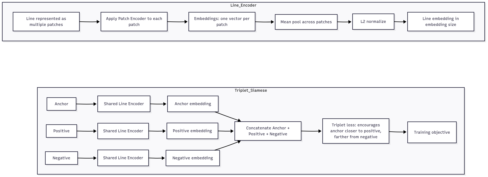
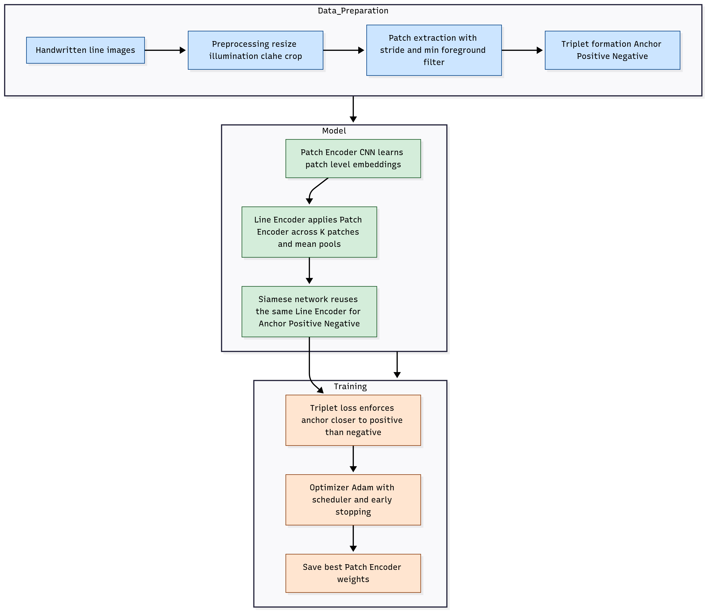
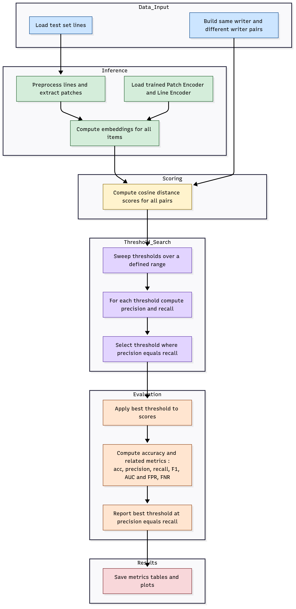

# A Deep Metric Learning Framework for Analyzing Handwriting by Writer: Verification, Retrieval, and Clustering


## Writer Verification (Line-level, Patch Pooling)

This project verifies whether two handwriting **lines** come from the **same writer**.
It uses a robust preprocessing pipeline + content-aware **patch pooling** and learns a writer-style embedding with a **triplet loss**.


## Writer Verification (Page-level, Line Pooling)

This project further verifies whether two handwriting **pages** come from the **same writer**.
It first extract **Lines** from a page using **easyocr**, then do **line embeddings** of these lines, then do **mean pooling** of these lines, that represents **page level embeddings**. 

Then the model compares two page level embeddings and finds cosine distance to determine whether they are of the same writer or different.


# Folder Order

**1. data**

**2. preprocessing**

**3. modeling**

**4. reports**

**5. trained_model**

**6. line_comparison**

**7. page**

**8. retrieval**

**9. clustering**


# All Pipelines:


# 0. Setup environment


### Create virtual envorntment

```
conda create --name "pt-gpu
```

```
conda activate pt-gpu
```

### For faster training/testing/using the system on NVIDIA GPU:

#### Setup-NVIDIA-GPU-for-Deep-Learning

##### Step 1: NVIDIA Video Driver

You should install the latest version of your GPUs driver. You can download drivers here:
 - [NVIDIA GPU Drive Download](https://www.nvidia.com/Download/index.aspx)

##### Step 2: Visual Studio C++

You will need Visual Studio, with C++ installed. By default, C++ is not installed with Visual Studio, so make sure you select all of the C++ options.
 - [Visual Studio Community Edition](https://visualstudio.microsoft.com/vs/community/)

##### Step 3: Anaconda/Miniconda

You will need anaconda to install all deep learning packages
 - [Download Anaconda](https://www.anaconda.com/download/success)

##### Step 4: CUDA Toolkit

 - [Download CUDA Toolkit](https://developer.nvidia.com/cuda-toolkit-archive)

##### Step 5: cuDNN

 - [Download cuDNN](https://developer.nvidia.com/rdp/cudnn-archive)

Copy cuDNN libraries into CUDA libraries.

##### Step 6: Install PyTorch 

 - [Install PyTorch](https://pytorch.org/get-started/locally/)

Modeling of this system was done using PyTorch. This is due to the hardship of training with tensorflow on gpu. As cuda version or cuDNN version doesn't always match for tensorflow, so it was feasible to just use PyTorch.

##### Finally run the following script to test your GPU

```bash
python -m modeling.gpu
```

##### For training this project the following was used:

**CUDA VERSION: 12.8**

**cuDNN Version: 8.9.7**

**python 3.9.13**

**PyTorch stable (2.8.0)**


### Install

```bash
pip install -r requirements.txt
```


---


<br>
<br>

# 1. data


### Dataset folder structure

```
./data/Train/<writer_id>/<doc_id>/*.jpg       --- line dataset
./data/Test/<writer_id>/<doc_id>/*.jpg        --- line dataset
./data/Evaluate_For_Pages/<writer_id>/*.jpg   --- page dataset
./data/Test_For_Pages/<writer_id>/*.jpg       --- page dataset
./Different_data_set_for_retrieval_and_clustering_testing/*.tif  --- different page dataset for testing retrieval + clustering

```

You can customize dataset and use datatype: ".jpg", ".jpeg", ".png", ".bmp", ".tif", ".tiff" .


### Dataset split:

<br>

**Training with fewer dataset (140 training + validation)**


<br>

<br>

**Training with larger dataset (214 training + validation)**


<br>


### `dataset.py` : 

<br>


<br>

1. `index_writer_images` function indexes lines by writers.

2. `split_writers` function splits Train data to train and validation set. (80%, 20%). Here train and validation set wrtiers are completely disjoint.

3. `sample_two_distinct` function takes items as input and retuns random two items. 


### Role : 

The role of this pipeline is to properly index dataset (lines) by writers from the directory. Split writers into train + validation set. 


<br>
<br>

# 2. preprocessing 


### `pipeline.py` 

<br>


<br>


### Visualize preprocessing pipeline (Preprocessing + Extract Patches):


```bash
python -m preprocessor.view_preprocessor --file ./data/Train/1/1_1/1_1_3.jpg --show-patches
```

<br>

**Preprocessing Line:**

<br>


<br>

**Extract Patches:**


<br>
<br>

#### Preprocess Line:

1.  Convert the image to grayscale for uniform input.
    
2.  Optionally correct uneven lighting.
    
3.  Optionally enhance contrast for clearer strokes.
    
4.  Build a mask to separate text from background.
    
5.  Detect tight text boundaries to remove empty margins.
    
6.  Crop around text (or keep full image if none found).
    
7.  Resize to a standard height while keeping proportions.
    
8.  Place on a fixed-width canvas with recorded bounds.
    
9.  Normalize pixel values and ensure single channel.
    
10.  Record ink coverage and debug information.
    
11.  Output a clean, standardized line image.
    


#### Extract Patches (content-only):

1.  Focus on the text region defined by bounds.
    
2.  Slide a fixed-size window across the text line.
    
3.  Pad at the right edge if the patch is too narrow.
    
4.  Keep patches with enough ink, discard empty ones.
    
5.  Stop when end of text or max patches reached.
    
6.  If no valid patches, take one centered fallback.
    
7.  Stack patches into a consistent batch for the model.


<br>
<br>

# 3. modeling


### Model Architecture : `model_defs.py`


**Patch Encoder (CNN)**


<br>


**Line Encoder + Triplet Siamese**



<br>


### Training : `train.py`




<br>


**Start training**

```bash
python -m modeling.train
```

- Saves weights into `./trained_model`.

In the console you will see epochs and progress of training.


### Evaluate : `evaluate.py`



<br>

**Start evaluation:**

```bash
python -m modeling.evaluate
```

This builds same-writer pairs and balanced different-writer pairs, computes distances,
sweeps a threshold, and prints Accuracy, Precision/Recall/F1, FAR/FRR, and AUC. Also plots graph ((acc, precision, recall, f1, AUC, FPR, FNR)  vs threshold)


<br>
<br>


### `model_defs.py` — model architecture

-   **Patch Encoder**: compact CNN over single-channel patches → conv plus relu blocks with max-pool → flatten → dropout → dense → **L2-normalized patch embedding**.
    
-   **Line Encoder**: applies the Patch Encoder to **K** patches from a line → **mean-pools** the K embeddings → **L2-normalizes** to get the **line embedding**.
    
-   **Triplet Siamese**: three **shared** Line Encoder branches for **anchor positive negative** → **triplet loss** with margin trains the embedding space.
    


### `train.py` — training

-   **Triplet batch generator**:
    
    -   Preprocess each line, **extract content-aware patches**, then **force exactly K patches per line** by sampling or repeating so every line has the same coverage.
        
    -   Each batch forms **anchor and positive from the same writer** and a **negative from a different writer**; returns arrays shaped **batch by K by patch by patch by 1**.
        
-   **Loop**: loads config and seeds, indexes training images by writer, iterates batches, runs forward and backprop, updates optimizer and scheduler, validates, early-stops, and **saves the best weights** for deployment.
    


### `evaluate.py` — evaluation

-   **Embed lines**: for each line, **preprocess → extract content patches → Patch Encoder → mean-pool → L2-normalize** to a single line embedding.
    
-   **Score pairs**: sample **same-writer** and **different-writer** pairs, compute **cosine distance** per pair, and create a **threshold grid** to sweep metrics.
    
-   **Find operating point**: sweep once to collect **accuracy precision recall F1 FPR FNR** across thresholds, then compute two intersections via robust polyline intersection:
    
    -   **Precision equals Recall** → used as the **chosen threshold** for balanced operation.
        
    -   **FPR equals FNR** → **EER** reported as a reference.
        
-   **Report**: evaluate at the **PR equals RC** threshold and print **Accuracy Precision Recall F1 AUC** plus **TP TN FP FN FPR FNR**, and plot the sweep with both intersections marked.

<br>
<br>


# 4. reports 


### Training Configuration:


After extensive ablation across **stride**, **minimum foreground**, **canvas placement**, **learning rate**, **batch size**, **embedding dimension**, **triplet margin**, and **K patches per line**, we fixed the configuration that yielded the best validation performance: **patch size 128**, **stride 56**, **min foreground 0.04**, **random** canvas placement during training and **centered** placement for evaluation, **no** illumination correction and **no** CLAHE; optimization with **Adam** at **1e-4** learning rate, **batch size 16**, **embedding dimension 512**, **triplet margin 0.3**, and **K = 8** patches per line, trained for up to **50 epochs** with **early-stopping patience 10**.


### Training with Fewer dataset

We trained the writer‐verification model on a reduced cohort of 140 writers with a writer-disjoint validation split, reserving a separate set of 10 writers for testing.  Per epoch took around 5 minute 40 seconds. Training loss steadily decreased, and the validation loss improved multiple times early on, reaching its best value at epoch 17 (val_loss ≈ 0.0492); subsequent epochs fluctuated around 0.05–0.06 without surpassing this minimum. Early stopping was triggered after 10 epochs with no validation improvement, and the best checkpoint (epoch 17) was retained, with the final patch-encoder weights saved. 

<br>


<br>


### Training on Larger dataset:


We trained the writer-verification model on a larger cohort of **215 writers** for training plus validation, and evaluated on **15 held-out writers**, all of which are disjoint like before. Validation loss dropped rapidly in the first epochs **0.1583 → 0.1088 → 0.0875 → 0.0830 → 0.0781** by epoch 5, then improved steadily to a best **val_loss ≈ 0.04449** at **epoch 35**. Subsequent epochs fluctuated around **0.044–0.051** without surpassing the minimum; early stopping triggered after 10 epochs with no improvement, and the best checkpoint (epoch 35) was retained, with weights saved for downstream evaluation. 

<br>


<br>


### Evaluation Configuration:

Positive sample = same writer pair, Negative sample = different writer pair.
We observe that changing the **positive sample to negative sample ratio** in evaluation shifts the **precision–recall trade-off** substantially: more positives tend to raise recall and lower precision, while more negatives do the opposite. In contrast, **AUC** and even **overall accuracy** remain relatively **stable** across these ratio changes, indicating that the underlying score distributions are well separated and robust to class priors. To provide a **balanced evaluation**, we therefore fixed the test composition to **positives = negatives**. Finally, to select a **balanced operating threshold**, we chose the point where **precision equals recall**; this yields symmetric error tendencies and a single interpretable decision point for verification.


### Evaluation report on fewer dataset trained model

<br>

| Item                  |              Value | Item                       |                      Value |
| --------------------- | -----------------: | -------------------------- | -------------------------: |
| Writers evaluated     |                 16 | Pairs sampled              |                       2000 |
| Positives same-writer |               1000 | Negatives different-writer |                       1000 |
| Threshold selection   | Precision = Recall | Chosen threshold           |               **0.397667** |
| Accuracy              |         **0.8515** | AUC                        |                 **0.9314** |
| Precision             |             0.8511 | Recall                     |                     0.8520 |
| F1                    |             0.8516 | EER  FPR = FNR             | **0.1485** at **0.397667** |
| TP                    |                852 | TN                         |                        851 |
| FP                    |                149 | FN                         |                        148 |
| FPR  FAR              |             0.1490 | FNR  FRR                   |                     0.1480 |
---

<br>


With a balanced set of 1000 positive and 1000 negative pairs, the PR = RC operating point yields 85.15% accuracy and a near-symmetric error profile FPR ≈ FNR ≈ 0.148. The high AUC = 0.9314 indicates strong separability of embeddings; the selected threshold 0.3977 provides an interpretable, balanced trade-off for verification.

<br>


### Evaluation report on larger dataset trained model

<br>

| Item                  |              Value | Item                       |                      Value |
| --------------------- | -----------------: | -------------------------- | -------------------------: |
| Writers evaluated     |                 16 | Pairs sampled              |                       2000 |
| Positives same-writer |               1000 | Negatives different-writer |                       1000 |
| Threshold selection   | Precision = Recall | Chosen threshold           |               **0.494000** |
| Accuracy              |         **0.9010** | AUC                        |                 **0.9656** |
| Precision             |             0.9010 | Recall                     |                     0.9010 |
| F1                    |             0.9010 | EER  FPR = FNR             | **0.0990** at **0.494000** |
| TP                    |                901 | TN                         |                        901 |
| FP                    |                 99 | FN                         |                         99 |
| FPR  FAR              |             0.0990 | FNR  FRR                   |                     0.0990 |
---

<br>


On a balanced 2000-pair test set, the PR=RC operating point yields 90.10% accuracy with a symmetric error profile FPR ≈ FNR ≈ 0.099. The AUC = 0.9656 indicates excellent separability, and the threshold 0.4940 provides a clear, balanced setting for verification.

<br>
<br>


# 5. trained_model

We saved trained models and best check points during epochs.

`patch_encoder_best_v03.pt` is trained model on 140 writers.

`patch_encoder_best_v04.pt` is trained model on 214 writers.


<br>
<br>


# line_comparison


