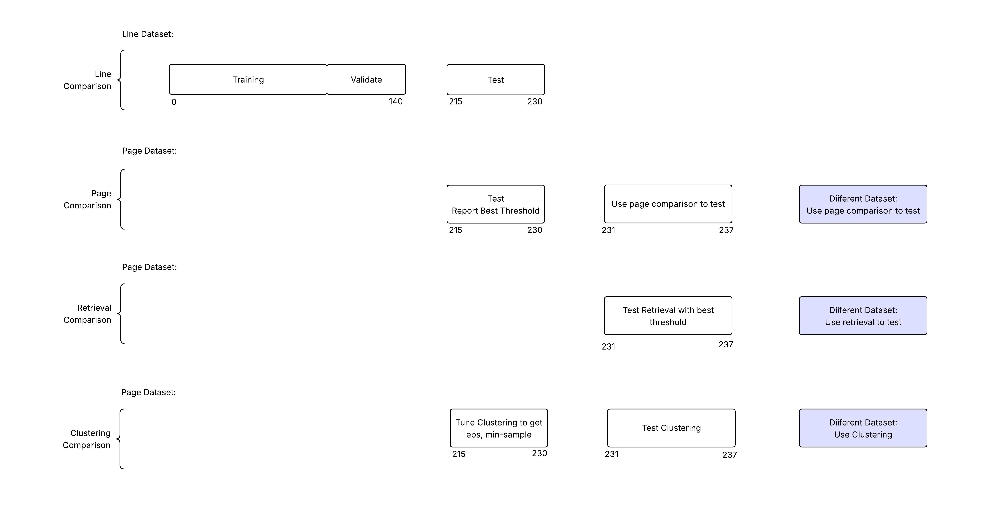
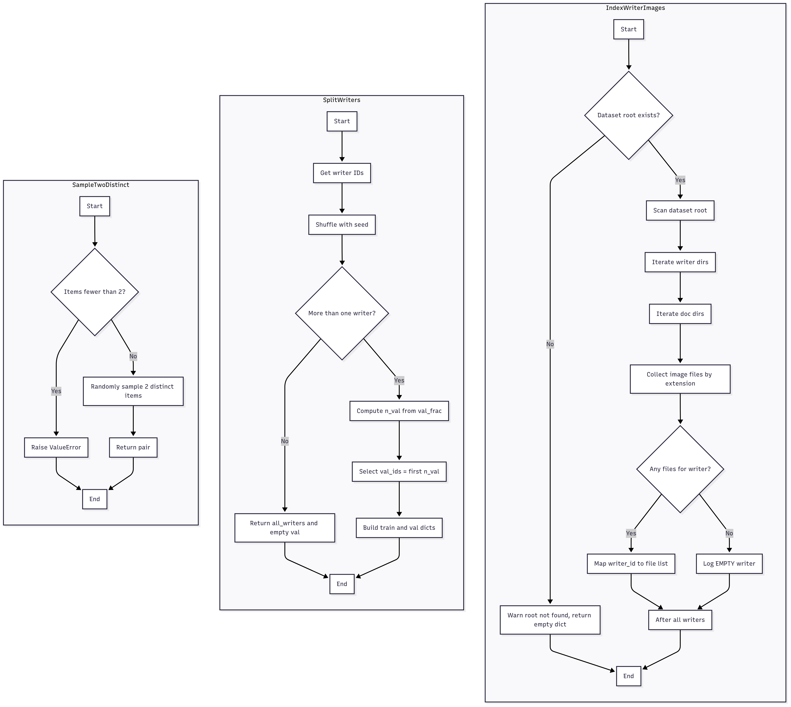

# A Deep Metric Learning Framework for Analyzing Handwriting by Writer: Verification, Retrieval, and Clustering


## Writer Verification (Line-level, Patch Pooling)

This project verifies whether two handwriting **lines** come from the **same writer**.
It uses a robust preprocessing pipeline + content-aware **patch pooling** and learns a writer-style embedding with a **triplet loss**.


## Writer Verification (Page-level, Line Pooling)

This project further verifies whether two handwriting **pages** come from the **same writer**.
It first extract **Lines** from a page using **easyocr**, then do **line embeddings** of these lines, then do **mean pooling** of these lines, that represents **page level embeddings**. 

Then the model compares two page level embeddings and finds cosine distance to determine whether they are of the same writer or different.


# Folder Order

**1. data**

**2. preprocessing**

**3. modeling**

**4. reports**

**5. trained_model**

**6. line_comparison**

**7. page**

**8. retrieval**

**9. clustering**


# All Pipelines:


## 0. Setup environment


### Create virtual envorntment

```
conda create --name "pt-gpu
```

```
conda activate pt-gpu
```

### For faster training/testing/using the system on NVIDIA GPU:

#### Setup-NVIDIA-GPU-for-Deep-Learning

##### Step 1: NVIDIA Video Driver

You should install the latest version of your GPUs driver. You can download drivers here:
 - [NVIDIA GPU Drive Download](https://www.nvidia.com/Download/index.aspx)

##### Step 2: Visual Studio C++

You will need Visual Studio, with C++ installed. By default, C++ is not installed with Visual Studio, so make sure you select all of the C++ options.
 - [Visual Studio Community Edition](https://visualstudio.microsoft.com/vs/community/)

##### Step 3: Anaconda/Miniconda

You will need anaconda to install all deep learning packages
 - [Download Anaconda](https://www.anaconda.com/download/success)

##### Step 4: CUDA Toolkit

 - [Download CUDA Toolkit](https://developer.nvidia.com/cuda-toolkit-archive)

##### Step 5: cuDNN

 - [Download cuDNN](https://developer.nvidia.com/rdp/cudnn-archive)

Copy cuDNN libraries into CUDA libraries.

##### Step 6: Install PyTorch 

 - [Install PyTorch](https://pytorch.org/get-started/locally/)

Modeling of this system was done using PyTorch. This is due to the hardship of training with tensorflow on gpu. As cuda version or cuDNN version doesn't always match for tensorflow, so it was feasible to just use PyTorch.

##### Finally run the following script to test your GPU

```bash
python -m modeling.gpu
```

##### For training this project the following was used:

**CUDA VERSION: 12.8**

**cuDNN Version: 8.9.7**

**python 3.9.13**


### Install

```bash
pip install -r requirements.txt
```


---


## 1. data


### Dataset folder structure

```
./data/Train/<writer_id>/<doc_id>/*.jpg       --- line dataset
./data/Test/<writer_id>/<doc_id>/*.jpg        --- line dataset
./data/Evaluate_For_Pages/<writer_id>/*.jpg   --- page dataset
./data/Test_For_Pages/<writer_id>/*.jpg       --- page dataset
./Different_data_set_for_retrieval_and_clustering_testing/*.tif  --- different page dataset for testing retrieval + clustering

```

You can customize dataset and use datatype: ".jpg", ".jpeg", ".png", ".bmp", ".tif", ".tiff" .


### Dataset split:

<br>

**Training with fewer dataset (140 training + validation)**



<br>

<br>

**Training with larger dataset (214 training + validation)**


<br>


### `dataset.py` : 

<br>



<br>

1. `index_writer_images` function indexes lines by writers.

2. `split_writers` function splits Train data to train and validation set. (80%, 20%). Here train and validation set wrtiers are completely disjoint.

3. `sample_two_distinct` function takes items as input and retuns random two items. 


### Role : 

The role of this pipeline is to properly index dataset (lines) by writers from the directory. Split writers into train + validation set. 


## 2. preprocessing 


### `pipeline.py` 

<br>


<br>


### Visualize preprocessing pipeline (Preprocessing + Extract Patches):


```bash
python -m preprocessor.view_preprocessor --file ./data/Train/1/1_1/1_1_3.jpg --show-patches
```

<br>

**Preprocessing Line:**

<br>


<br>

**Extract Patches:**


<br>


# Train

```bash
python -m modeling.train
```
- Uses `./Train` and splits writers into train/val (unless you specify `paths.val_dir`).
- Saves weights into `./trained_model`.

# Evaluate (on explicit `./Test`)

```bash
python -m modeling.evaluate
```

This builds same-writer pairs and balanced different-writer pairs, computes distances,
sweeps a threshold, and prints Accuracy, Precision/Recall/F1, FAR/FRR, and AUC.


## Predict on Two Lines

```bash
python -m use_model.predict --config config.yml --img_a ./data/Test/26/26_2/26_2_1.jpg --img_b ./data/Test/27/27_1/27_1_2.jpg
```

Outputs cosine distance and a decision using the threshold from `config.yml`.


## Notes
- Preprocessing is in `preprocessor/pipeline.py`.
- Model definitions live in `modeling/model_defs.py`.


---
---
---
